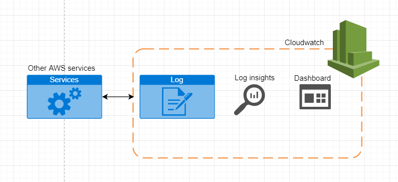
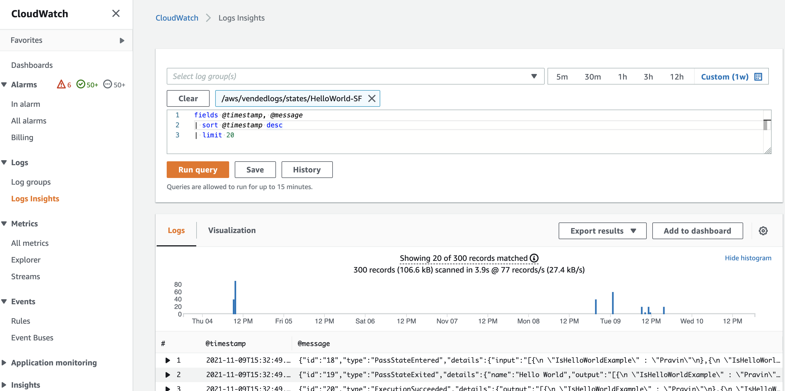
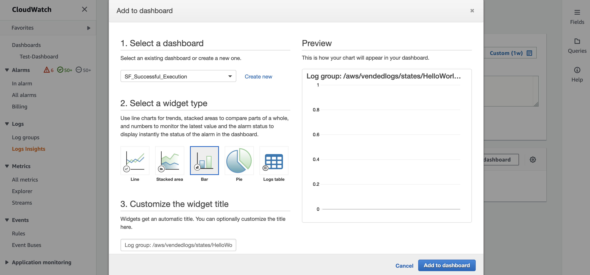
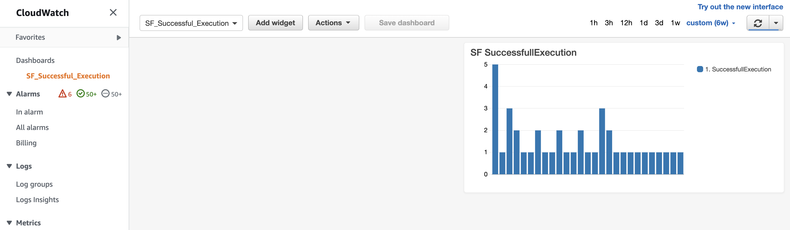

## CloudWatch Dashboard with Log insights using Log groups

> Author: PravinKumar S

> Last Reviewed Date: 11/09/2021

## Contents

- [Overview](#overview)
- [Architecture diagram](#architecture-diagram)
- [What is CloudWatch Dashboard](#what-is-cloudwatch-dashboard)
- [Amazon CloudWatch Logs](#amazon-cloudwatch-logs)
- [CloudWatch Log Insights](#cloudwatch-log-insights)
- [Sample query](#sample-query)
- [Creating CloudWatch Dashboard using Loginsights](#creating-cloudwatch-dashboard-using-loginsights)
- [Conclusion](#conclusion)


### Overview
Multiple AWS resources require constant monitoring and regular analysis of their run status and performance. Cloud Watch Dashboard can be used to meet this requirement by specifying the metrics of the resources as the source. Additionally, CloudWatch Log insights queries can be used as a source for Dashboards that help you analyze AWS resource performance.

### Architecture diagram



### What is CloudWatch Dashboard

CloudWatch dashboards let you view all of your resources in a single view from within the CloudWatch console. CloudWatch dashboards to create customized views of the metrics and alarms for your AWS resources. It provides a common view of critical resources and application measurements for faster communication flow during operational events.

### Amazon CloudWatch Logs

The CloudWatch logs consolidate logs from different AWS services and applications into a single highly scalable service. The logs from different resources, such as EC2, Route 53, and others, can be collected. 

#### Significance of enabling CloudWatch Logs

* CloudWatch Logs can be used to query the Log data using Log insights.
* CloudWatch Logs retention policy can be altered as per requirement and will not expire.
* Also, helps in monitoring AWS CloudTrail logged events.

### CloudWatch Log Insights

Amazon CloudWatch Logs Insights allows you to search and analyze your log data interactively. Queries can be developed more efficiently and effectively to respond to the operational issues. CloudWatch Logs Insights automatically discovers fields in logs from AWS services. A single request can query up to 20 log groups. Queries time out after 15 minutes, if they have not completed.

Log Insights (CloudWatch -> Logs -> Logs Insights) query window can be used to write custom queries and sample queries specific to services like Lambda, CloudTrail, Route53 are also available. Custom queries used to pull data and analyse can be saved under queries for further reference. Also, it can be created as CloudWatch dashboard to display in different chart format.

CloudWatch Logs Insights queries incur charges based on the amount of data that is queried. For pricing details, (https://aws.amazon.com/cloudwatch/pricing/)

#### Sample query:

Queries on Lambda logs - Determine the amount of overprovisioned memory.

``` 
filter @type = "REPORT"
    | stats max(@memorySize / 1000 / 1000) as provisonedMemoryMB,
        min(@maxMemoryUsed / 1000 / 1000) as smallestMemoryRequestMB,
        avg(@maxMemoryUsed / 1000 / 1000) as avgMemoryUsedMB,
        max(@maxMemoryUsed / 1000 / 1000) as maxMemoryUsedMB,
        provisonedMemoryMB - maxMemoryUsedMB as overProvisionedMB
    
```

Queries for CloudTrail logs - Find the Amazon EC2 hosts that were started or stopped in a given AWS Region.

```
filter (eventName="StartInstances" or eventName="StopInstances") and region="us-east-2"

```
Find the AWS Regions, user names, and ARNs of newly created IAM users.

```
filter eventName="CreateUser"
    | fields awsRegion, requestParameters.userName, responseElements.user.arn

```

Extracts the loggingTime, loggingType and loggingMessage. 
Further, filters down to log events that contain ERROR or INFO strings. 
However, displays only the loggingMessage and loggingType fields for events that contain an ERROR string.

```
FIELDS @message
    | PARSE @message "* [*] *" as loggingTime, loggingType, loggingMessage
    | FILTER loggingType IN ["ERROR", "INFO"]
    | DISPLAY loggingMessage, loggingType = "ERROR" as isError
```

Reference: 
https://docs.aws.amazon.com/AmazonCloudWatch/latest/logs/CWL_QuerySyntax.html
https://docs.aws.amazon.com/AmazonCloudWatch/latest/logs/CWL_QuerySyntax-examples.html

### Creating CloudWatch Dashboard using Loginsights:

1. Go to CloudWatch console and open LogInsights. Choose the Log group of the resource planned for querying and analysis. Queries can be developed manually or altered from the sample queries available in the right. 



2. Once the query output is sufficient, click on "Add to dashboard". Create a new Dashboard with title and type of widget type. (Example: Bar, Line, Pie) 



3. Finally, Add to dashboard to see the query analysis chart getting refreshed automatically based on the frequency provided.



### Conclusion:

Generally, the CloudWatch dashboard with LogInsight queries helps in analysing the individual resources and their performance seemlessly. LogInsight queries can also be saved to aid in troubleshooting.