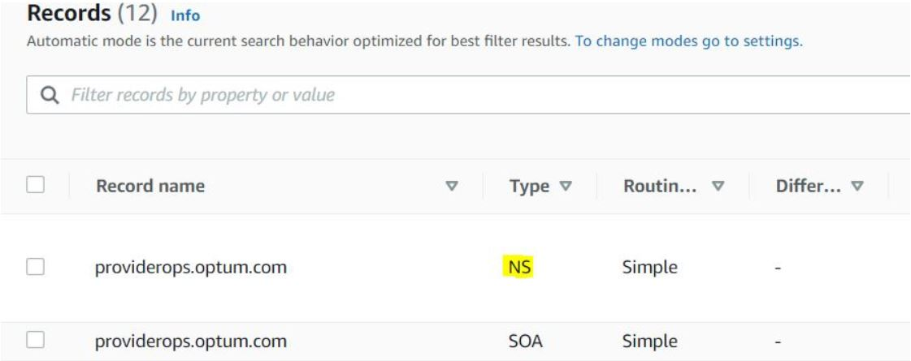
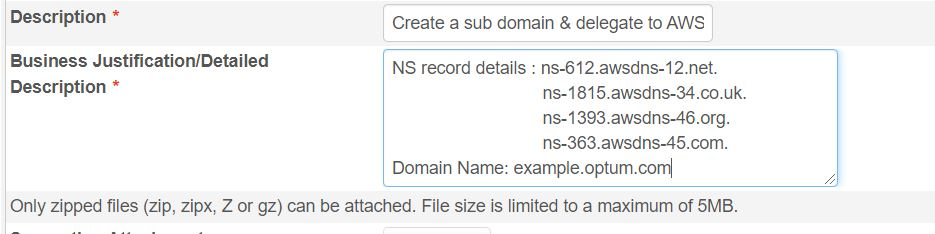
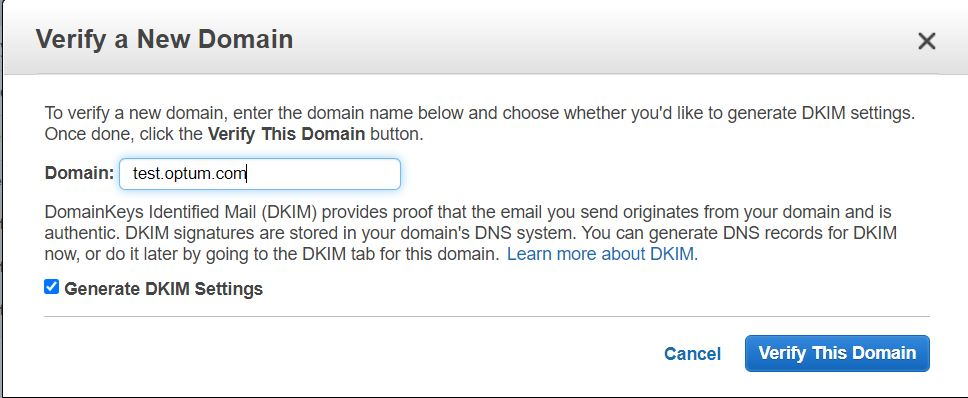
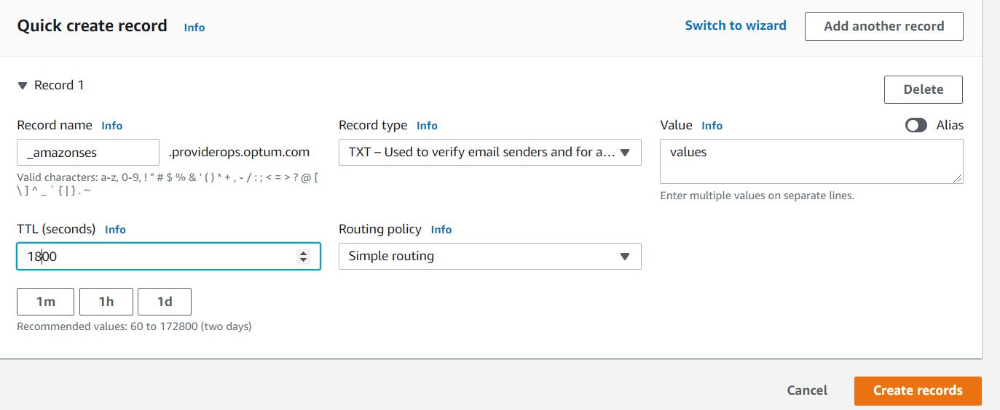
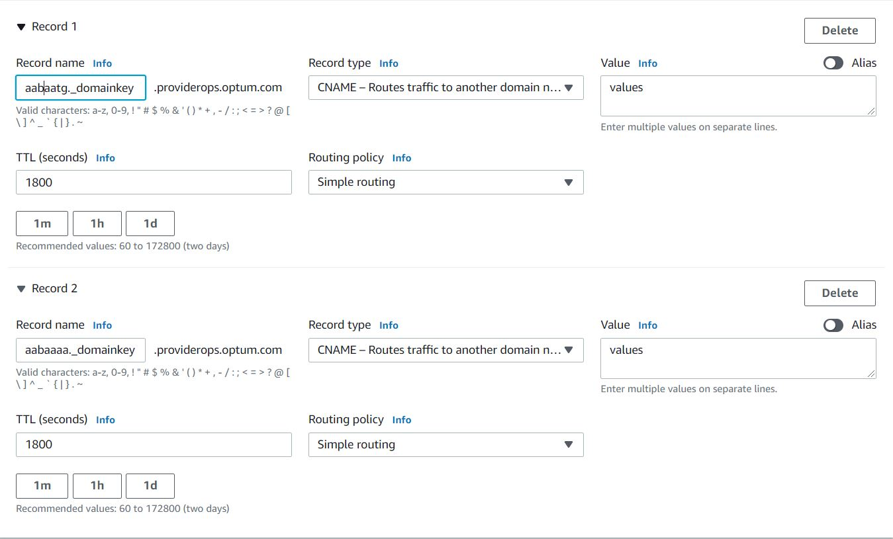
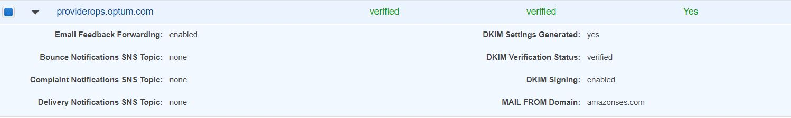
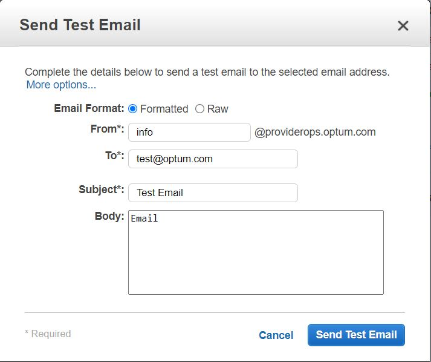

### AWS DNS creation

> Point of Contact: Navaneethan Gunasekaran

> Last Reviewed Date: 11/02/2021

### 1. Overview
#### 1.1. Purpose

   Amazon Route 53 is a highly available and scalable cloud Domain Name System (DNS) web service. It is designed to give developers and businesses an extremely reliable and cost effective way to route end users to Internet applications by translating names like www.example.com into the numeric IP addresses like 192.0.2.1 that computers use to connect to each other. Amazon Route 53 is fully compliant with IPv6 as well.

   Amazon Route 53 effectively connects user requests to infrastructure running in AWS such as Amazon EC2 instances, Elastic Load Balancing load balancers, or Amazon S3 buckets and can also be used to route users to infrastructure outside of AWS. 
   
#### 1.2. Scope

   1) SES setup for the new subdomain
   2) Certificate creation for the new sub domain

### 2. Pre-requisites
   
   Check whether that the subdomain you chosen is availble and not already in use
   
### 3. Configuration steps

#### 3.1. SES setup for the new subdomain

Below are the list of steps to be followed to create a new sub-domain in DNS and verify it in SES, so that emails can be sent from AWS.

##### 3.1.1. Subdomain Availability 
   
   Verify the domain is available by Sending an email to ISO-IPAM_DL@ds.uhc.com                                     

##### 3.1.2. Hosted Zone Creation in Route53

   Create the new subdomain in Route53 - Hosted Zones. Choose Public Hosted Zones, click on the new subdomain to get the NS records for the subdomain.

##### 3.1.3. DMARC and SPF Records Creation in Route53
   Create the DMARC records in route53 

   Record name: _dmarc.***SUBDOMAIN.DOMAIN.com***

   Record type: TXT

   Routin Policy: Simple

   Value: "v=DMARC1; p=reject; fo=1; ri=3600; rua=mailto:unitedhealthgroup@rua.agari.com; ruf=mailto:unitedhealthgroup@ruf.agari.com"

   Create the SPF record in route53 

   Record name: mail.***SUBDOMAIN.DOMAIN.com***

   Record type: TXT

   Routin Policy: Simple
   
   Value: "v=spf1 include:amazonses.com include:_spfv4.corpmailsvcs.com include:spf.protection.outlook.com -all"
   

##### 3.1.4. Subdomain creation in DNS

   Create a Service Now request to the DNS team to create the new subdomain in DNS & delegate to AWS.
   Share NS record details in Request - [SubDomain Creation in DNS](https://servicecatalog.uhc.com/sc/catalog.product.aspx?product_id=InfrastructureEngineeringEngagement)  
                          

Sample ticket - [1912578-6257368](https://servicecatalog.uhc.com/sc/checkout.summary.aspx?order_number=1912578&showOrder=true&system_created=0%3e) and [1914237-6264742](https://servicecatalog.uhc.com/sc/checkout.summary.aspx?order_number=1914237&showOrder=true&system_created=0%3e)
Once the request is completed, this can be verified using the commands - nslookup -type=txt _subdomain _and nslookup -norecurse _subdomain_

##### 3.1.5. SES Setup for new subdomain 

* Create the new subdomain in AWS SES. 

* Click on the new domain that was created in SES. Note down the TXT and DKIM values as these needs to be added in the subdomain under Route 53. 

* Choose Create Record in Route 53 Hosted Zones - subdomain. Specify the TXT name as **_amazonses** and the value obtained from SES.

* Create Record to specify DKIM records for the new subdomain. Specify the DKIM Name, type as CNAME and value obtained from SES. Choose Add Another Record to add the 3 DKIM values for the subdomain.

* Usually it takes some time for the new subdomain to get verified from SES.

##### 3.1.6. SES Setup Verification

Once the status changes to verified, this can be tested by choosing the subdomain in SES and **Send a Test Email**. In order to send emails within the Organization Tag needs to be updated in the Agari systems for the new subdomain. Reach out to david_simpson@optum.com to have this update completed. 

#### 3.2. Certificate creation for the new sub domain

##### 3.2.1. Hosted zone and subdomain creation

   Follow the steps 3.1.2 anf 3.1.3 to create the hosted zone and sub domain.

##### 3.2.2. Venafi access

Create a ServiceNow request to get access to Venafi. [Venafi access](https://optum.service-now.com/itss2/?id=sc_cat_item&sys_id=0f703319db8abb0098e940ceaa961946&sysparm_category=994ca5541b24ffc0c04c0d076e4bcb03)

Sample ticket - [RITM1440035](https://optum.service-now.com/itss2?id=itss2_ritm_form&table=sc_req_item&sys_id=f7b612ebdb80705c2336e7970596192d&view=ess)
Secure Group Approver and Owner for the Venafi group has to be provided.

Once the Owner approves the request, list of instructions with the Secure Group name for Venafi access will be received by the requestor. Try accessing [Venafi](https://certificateservices.optum.com/vedadmin/Login.aspx?auto=1) after getting added to the respective Secure group.

##### 3.2.3. Certificate Creation in Venafi

* Login to Venafi, under team folder, Choose Team Name Folder -> Certificates -> Right-Click one of the required certificate folder -> Add -> Certificate(Type).

* Provide the Certificate Name and Description in "General Information" section.

* Provide the Common Name (Set this to new subdomain name) in "Subject DN" section.

* Once this is done, click "Save". After it is saved, select the certificate, and choose "Renew Now".

##### 3.2.4. Download Certificate

* Choose  Certificate -> "Settings" -> "Download" -> "Certificate"

* Select the following options: Include Private Key, Include Root Chain, For "Format" select Base64 (PKCS #8), Input and confirm a password of your choice.

* Once this is done, the pem file will be downloaded. The below command needs to be run to create the Key file from the pem file.
`openssl rsa -in DOWNLOADED_FILE.pem -out NAME_FOR_KEY.key`

##### 3.2.5. Upload Certificate to AWS

* Open "AWS Certificate Manager" service and Choose "Import Certificate".

* For the "Certificate Body" from the downloaded pem file, select the first Certificate section where the certificate relates to your domain. Ex: subject=CN=test.optum.com.

* For the "Certificate private key" copy and paste the output from the key file that was done in step 8.

* For the "Certificate Chain" copy everything else besides the key and the body certificate from the pem file.

