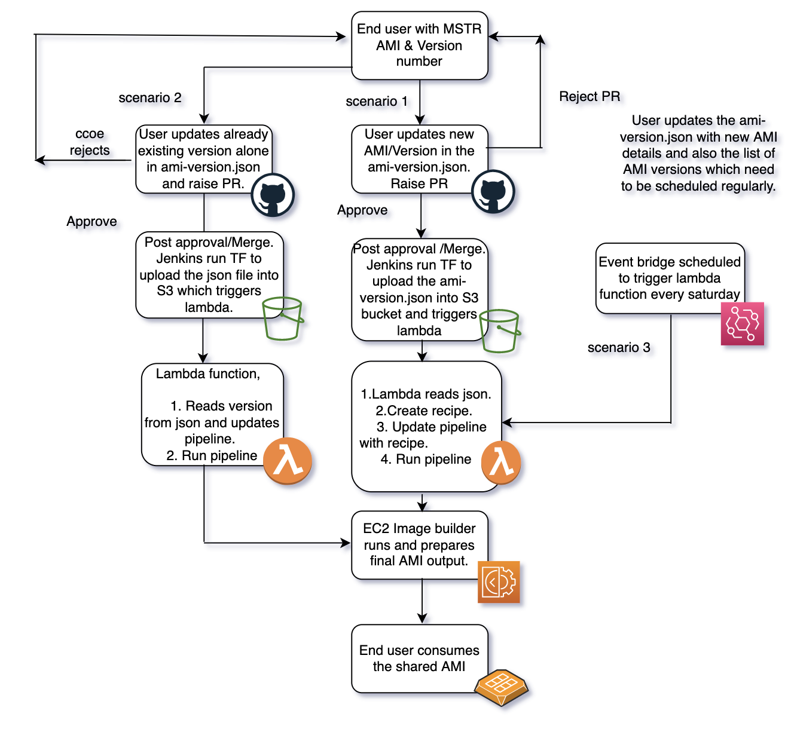

## On-boarding steps to consume customized AMI for MSTR base images

> Author: PravinKumar S

> Last Reviewed Date: 12/15/2021

## Contents

- [Overview](#overview)
- [Pre-requisite](#pre-requisite)
- [Usage](#usage)
- [Internal flow](#internal-flow)
- [Conclusion](#conclusion)

### Overview
EC2 Image Builder is a fully managed AWS service that makes it easier to automate the creation, management, and deployment of customized, secure, and up-to-date server images that are pre-installed and pre-configured with software and settings to meet specific IT standards. Teams like MSTR have their own custom AMI, which needs to be customized to fix security vulnerabilities and if any additional custom software to be installed. CCOE has developed a solution to automate this entire process and to ensure that a mechanism for review and approval is in place during the entire process.

### Pre-requisite

#### GitHub access:
Members of the MSTR team who pass AMI values as input, should be able to access the GitHub repository (https://github.optum.com/oaccoe/imagebuilder_mstr_ami) to raise pull request. In specific to get access to the OACCOE repository, please mail to - rakesh.pm@optum.com / wyatt_andersen@optum.com 

#### Role to be shared with CCOE
Role used to launch the EC2 instances, should be shared with CCOE team in advance. CCOE team will be adding this role into the KMS policy to grant permission to decrypt the encrypted AMI. 

### Usage

Reference module: https://github.optum.com/oaccoe/imagebuilder_mstr_ami

1. Role shared with CCOE earlier need to be updated with the KMS key arn as a inline policy in the end-user account. This is a one time requirement, if it is added before this step can be ignored. 

2. The end-user or MSTR team need to fork and clone the branch aws_imagebuilder_mstr_ami, and update ami-versions.json file with AMI value and version information. How to update the json is explained based on the scenarios below.

Versions json file path: https://github.optum.com/oaccoe/aws_imagebuilder/tree/aws_imagebuilder_mstr_ami/terraform/environments/nonprod/ami-versions.json

```

    "ami-version": [
      {
        "aminame": "ami-08bd941ae380bd3cd",
        "recipename": "110304"
      },
      {
        "aminame": "ami-08bd941ae380bd3cd",
        "recipename": "110302"
      }
    ],
    "ami-scheduled": [
      {
        "recipenames": "110304;110302"
      }
    ]
}
```

2. Raise pull request to the oaccoe / imagebuilder_mstr_ami -> master branch post the JSON file update. 

3. After approve and merge, json file will be uploaded to the respective S3 bucket.

### Scenario 1: Upon the release of the new MSTR AMI, the changes below need to be made

1. ami-version json block should be updated with new AMI as "aminame" & version number as "recipename". 
2. ami-scheduled block should be updated with the list of recipe names specified earlier demlimited with ';' , so that those recipes will be included in the scheduled run.

### Scenario 2: List of AMI versions alone need to be updated for regular run and no new AMI creation required.

1. ami-scheduled block should be updated with the list of recipe names to be scheduled and run regularly.

### Scenario 3: Updated scheduled AMI versions to be run on regular frequency

No actions required. Depending on the initial required Event bridge rule will be updated with a schedule to trigger lambda function regularly.

### Work flow



### Conclusion:

The MSTR teams can test and validate the final AMI and communicate its use to the product teams. Automating the process eliminated the need to create AMIs manually and created a central repository for sharing images. 

 :::tip

### Background setup from CCOE team

1. Terraform state files will be stored in dedicated S3 bucket with specified path. (s3://165387667510-tfstate-ccoesandbox/mstr-ami/terraform_mstrami.state)
2. Lambda function to trigger ImageBuilder pipeline will be created.
3. EC2 ImageBuilder to build pipelines to create AMI.
4. The EC2 ImageBuilder distribution list needs to be updated with the secondary account number that will consume the output AMI.
5. KMS key will be created which is required to encrypt storage volumes.
6. The KMS key policy will be updated with the required permissions for the role that will be accessing the AMI from another account.

:::