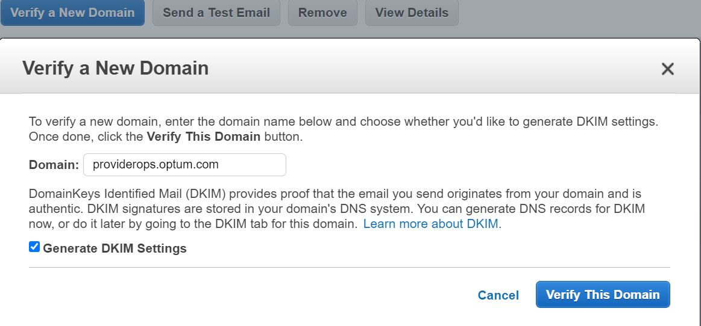
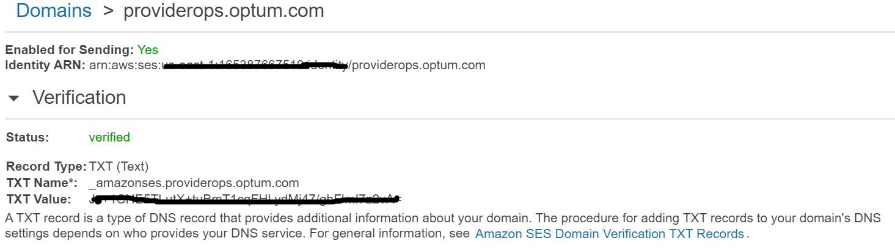
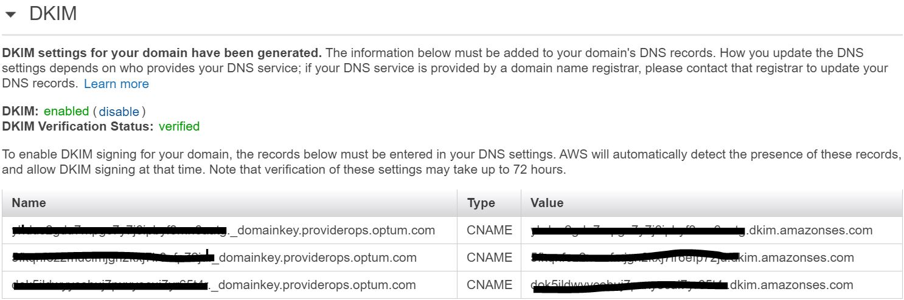
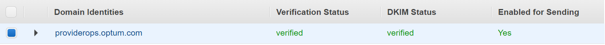

## Email Solution in public cloud

> Author: PravinKumar S

> Last Reviewed Date: 11/02/2021

## Contents

- [Overview](#overview)
- [Purpose](#purpose)
- [SES Domain Verification](#Domain-configuration-within-SES)
- [Send emails to Distribution List](#Sending-emails-to-Distribution-List)
- [Send emails to Group Mailbox](#Group-Mailbox)


### Overview
Amazon Simple Email Service is  a service available within AWS cloud, and is a reliable infrastructure that can serve in delivering emails to the end users. With Amazon SES, you can send email securely, globally, and at scale. 

### Purpose

Emails need to be sent from cloud environment to internal and external mail boxes. Also, emails need to reach Optum distribution lists (ds.uhc.com domain) whose MXRECORDS are not registered externally to get emails delivered from AWS cloud. Few of the identified solutions with the current Optum mail server restrictions are listed below.

### SES Domain Verification

**Step1:** Sign in to the AWS Management Console and navigate to Amazon Simple Email Service.


**Step2:** Domains -> Verify a New Domain -> Enter domain name (Ex:optum.com), select Generate DKIM Settings check box and click on Verify This Domain button. 



Note down(this information is needed in next step) Domain Verification Record and DKIM Record Set details and click on Close.






**Step3:** Raise a ticket in [Service Catalog](https://servicecatalog.uhc.com/) for getting the Domain details verified. Domain verification and DKIM Name, text and values need to be included in the ticket to get it added inside the DNS server.

Once after the above registration is complete, registered domain status will be as below and will be able to send mails.



Emails can be sent from the registered domains (in our case sub-domain as per policy) to both internal and external domains. However, Amazon SES will not be able to send emails to certain internal domains (ds.uhc.com - Distribution List mail server domain), because their MXRECORD are not registered externally. 


### Send emails to Distribution List

#### Azure email relay

In this method we are trying to send emails to relay server which is setup at Azure. Azure email relay server is something which helps in transferring emails from AWS cloud to Optum distribution list email server using the credentials provided in the SMTP configurations.  AWS IP ranges are white-listed in this server, so it accepts the incoming emails and forwards to Optum mail server. 

Azure Email relay account credentials can be requested through ( https://dojo.provider.engineering/docs/devops/services/cloud-email-relay/overview.html ) email. Refer the link for mail address and its procedure.

#### Sending emails through SMTP using python script

Below sample python code can be used for sending emails through SMTP, which is setup within Azure. Code can be used within Lambda or within the applications to send emails. Credentials and values need to be updated which are received,

```

!/usr/bin/python

import smtplib

sender = 'noreply@amazon.com'

receivers = ['maild@optum.com','distribution_list@ds.uhc.com']

message = """From: Amazon <no-reply@amazon.com>

To: Receiver_name <receiver_mailid@amazon.com>

Subject: SMTP e-mail test

This is a test e-mail message.
"""

smtpObj = smtplib.SMTP("omail.o360.cloud", 587)

smtpObj.starttls()

smtpObj.login("team_name@omail.o360.cloud","password")

smtpObj.sendmail(sender, receivers, message)

smtpObj.quit()

print "Successfully sent email"

```

#### Sending emails through SMTP config files

Similar to the above option we can also update the SMTP configuration details in the config files within the EC2 instances,

1. Use the credentials received above over mail to update the config files.

2. ssmtp.conf file within the instance need to be updated with the details received above.

  File path - "/etc/ssmtp/ssmtp.conf". 

```
 /etc/ssmtp.conf -- a config file for sSMTP sendmail.

 See the ssmtp.conf(5) man page for a more verbose explanation of the
 available options.

 The person who gets all mail for userids < 1000
 Make this empty to disable rewriting.
 
 root=mail_id@optum

 The place where the mail goes. The actual machine name is required
 no MX records are consulted. Commonly mailhosts are named mail.domain.com
 The example will fit if you are in domain.com and your mailhub is so named.

 UseSTARTTLS=YES
 
 mailhub=omail.o360.cloud:587

 AuthUser=account_name@omail.o360.cloud

 AuthPass=*******

 Debug=YES

 The full hostname
 Hostname=hostname

 Use SSL/TLS to send secure messages to server.
 
 UseTLS=YES

```

3. Sample email text file can be created as below,
> sample_mail.txt

```

Cc:mail_id@Optum.com

Subject: Test sending e-mail to DLs from EC2 via Azure email relay

From: mail_id@Optum.com

Content-Type: text/html; charset="utf8"

<html>
<body>
<h1>Test email to DL through SES</h1>
</body>
</html>

```

4.Update the "/etc/ssmtp/revaliases" file as well through editor,

```

 sSMTP aliases

Format: local_account:outgoing_address:mailhub

Example: root:your_login@your.domain:mailhub.your.domain[:port]
where [:port] is an optional port number that defaults to 25.

root:mail_id@optum.com:omail.o360.cloud:587

```
5. Test mails can be sent as below,

```

ssmtp -v mail_id@optum.com < sample_mail.txt

ssmtp -v Distribution_list_name@ds.uhc.com < sample_mail.txt

```

#### Send emails to Group Mailbox

This method is pretty straight forward, however group mail boxes or individual mails boxes need to managed or monitored to make sure its size is not growing full. In this method emails can be directly sent from AWS SES to individual email ID's within Optum.com mail server or to Optum Group mail box. These email are not blocked as the MXRECORD for optum.com domain are registered externally. Once the mails reach mail boxes, Outlook rules can be setup to forward the emails to specific distribution list(ds.uhc.com). 


:::tip 

Individual Optum email ids in the DL can be stored in AWS parameter store service as string (similar to a environment variable) and it can be handled within the code to retrieve the email IDs and emails can be forwarded. Email ID's within AWS parameter store can be added or removed as per requirement, however it becomes a manual activity whenever new emails need to be added or removed.

:::
