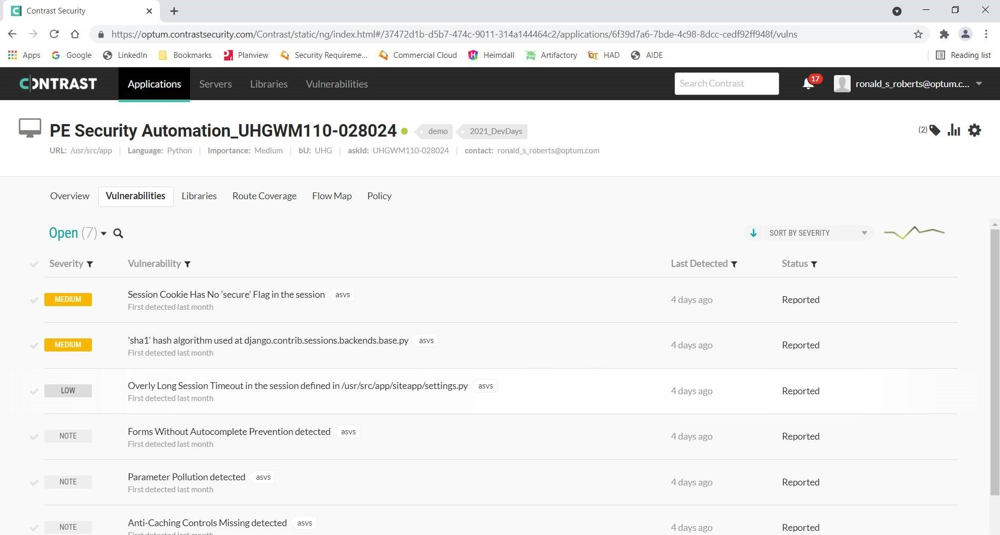

### Contrast integration with Jenkins

> Point of Contact: Atchaya Saminathan

> Last Reviewed Date: 09/22/2021

### 1. Overview
#### 1.1. Purpose 
    
   Contrast Security, a real-time application security testing tool that combines Static, Dynamic, and Interactive Application Security Testing (SAST, DAST, and IAST) to provide accurate and continuous information on security vulnerabilities in our code. The Contrast agent begins securing our code by adding sensors to the entire software stack of our applications.

   Contrast continuously analyzes applications in real-time for vulnerabilities and attacks. No need to schedule, re-run, or even re-configure. Once the Contrast Agent is installed on an application server, it automatically discovers new applications and changes to old ones.

   Contrast agents report from inside the application, so we can finally discover, fix and protect their own software without relying on security experts. This efficiency speeds up software development, and frees up application security experts to focus on the hardest problems.

   Contrast supports these languages / runtimes. You can also refer https://docs.contrastsecurity.com/en/install-and-configure-an-agent.html for more details about agents.

- Java 
- .NET Framework 
- .NET Core 
- Node.js 
- Python 
- Ruby 
- Golang beta
 
#### 1.2. Scope
   
   The scope of this document is to provide the steps to integrate the Optum's Contrast (https://optum.contrastsecurity.com/Contrast/) with Jenkins.
   
### 2. Pre-requisites

- Jenkins integration with GitHub (Web-hook) 

### 3. Configuration steps

#### 3.1. Configure the Contrast Connection 

- Go to Jenkins > Manage Jenkins > Configure System
- Scroll down until you see an option called Contrast Connections section. Please enter the following details,

| Field | Value | 
|------|-------------|
| Contrast username | Contrast user account ID (In most cases, this is your login ID) |
| Contrast URL | https://optum.contrastsecurity.com/Contrast/ |
| Organization ID | 37472d1b-d5b7-474c-9011-314a144464c2 |
| Contrast API key | Organization's API key |
| Contrast service key | Contrast user account service key |

You can get the above details from User Settings of your contrast profile. 

- Next to **Result of a vulnerable build**, use the drop-down menu to select how you want Contrast to mark your Jenkins job when your application is too vunerable. Options are Failure, Unstable, Success, Not_built and Aborted.

- Check the box next to **Fail build if application is not found in Contrast** if you want the Jenkins job to automatically fail whenever your Jenkins instance can't find your application.

- You can define the criteria that the Contrast plugin will use to determine whether an application is too vulnerable at the Jenkins system level. Check the box next to **Allow job level application vulnerability security controls to override those controls set here at the system level** if you want job level controls to override system level controls. Leave the box unchecked if you want to enforce consistency of criteria across all Jenkins jobs in your instance.

- Select **Test Contrast connection** to make sure that the plugin can authenticate to Contrast and retrieve information about your application's vulnerabilities and **Save**.


#### 3.2. Configure the contrast security yaml file

We should create the contrast_securtiy.yaml file with the below details in the root directory of applications which needs to be scanned.

*contrast_securtiy.yaml*

```
api:
    url: https://optum.contrastsecurity.com/Contrast/
    api_key: <apikey>
    service_key: <servicekey>
    user_name: <username>
agent:
    python:
    service:
      socket: /tmp/contrast.sock
    logger:
      path: /var/log/contrast_agent.log
      level: ERROR
    security_logger:
      path: /var/log/contrast_security.log
      level: ERROR
application:
    name: <appname_askid>
    # Security group/team group defined in contrast
    group: <Secure_group>
    metadata: bU=<bu>,contact=<user_email>,askId=<askid>
assess:
    # correlates to "version" in fortify, specify sub application name, ie: API Name, Client UI Name, etc...
    tags: SubapplicationName      
server:
    #if using a container or dynamically generated hostname, specify common hostname
    name: <servername>
    #version
    # development, qa, production
    environment: development    
```

#### 3.3. Configuring the Jenkinsfile

Add the stages like contrast agent download and contrast verification along with the other stages to bring up application with contrast agent.

*Jenkinsfile*

```
pipeline {
agent any
  stages {
    stage('Build Application') {
        ...
     }
    stage('Contrast Download') {  // This stage will download the contrasr python agent and run it.
      steps{
        sh "pwd"
        contrastAgent agentType: 'python', outputDirectory: "${pwd()}", profile: 'contrast_connection'   // profile is the contrast's connection name whcih we configured in jenkins
       }
     }
    stage('Run Application') {
      environment {
         ....
       }
      steps {
          ....   
       }
    }
    stage('Test Application') {
      ...
    }
    stage('Contrast Verification') {    // This stage will check the count of the vulnerabilities for the mentioned severity and fails the build if it exceeds 
        steps{
      contrastVerification applicationName: 'Application_name', profile: 'contrast_connection', queryBy: 1, severity: 'High', count: 10
      contrastVerification applicationName: 'Application_name', profile: 'contrast_connection', queryBy: 1, severity: 'Critical', count: 10   
     }
   }
 }
}
```

#### 3.4. Contrast dashboard

When we bring up the application with contrast agent, it will assess and post the results to the contrast based on the contrast_security.yaml found in the root directory. We can check our application and vulnerabilities in https://optum.contrastsecurity.com/Contrast/ by filtering application name.




