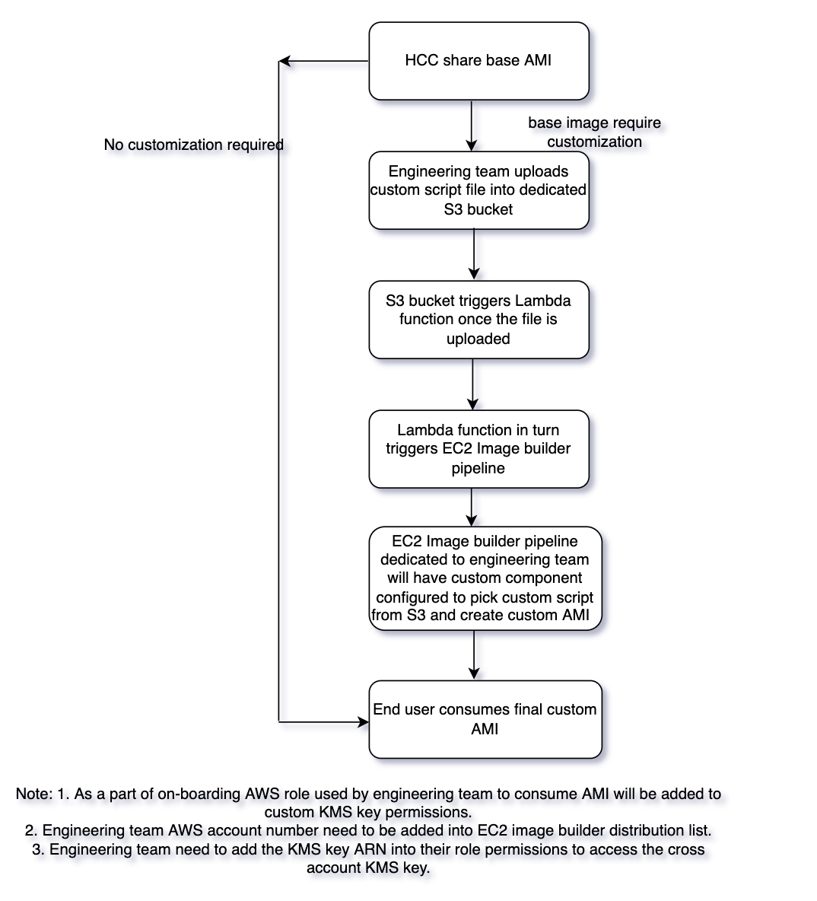

## On-boarding steps to consume customized AMI for MSTR base images

> Author: PravinKumar S

> Last Reviewed Date: 12/23/2021

## Contents

- [Overview](#overview)
- [On-boarding requirements from end-user](#on-boarding-requirements-from-end-user)
- [On-boarding steps from CCOE](#on-boardinG-steps-from-ccoe)
- [End-user Usage](#end-user-usage)
- [Internal flow](#internal-flow)
- [Conclusion](#conclusion)


### Overview
EC2 Image Builder is a fully managed AWS service that makes it easier to automate the creation, management, and deployment of customized, secure, and up-to-date server images that are pre-installed and pre-configured with software and settings to meet specific IT standards. HCC team started sharing securities updated base AMI across all the accounts within OPTUM to make sure teams use vulnerability free AMI's. However, different product teams have requirement to install their custom softwares on top of this shared custom AMI. CCOE team has developed a solution to automate this entire process, so that product teams can upload their software shell / powershell scripts into a dedicated S3 bucket which will inturn triggers Image builder pipeline to build customised AMI.

### On-boarding requirements from end-user

1. Product teams looking for customised AMI need to have access to their dedicated S3 bucket created in CCOE account with permissions to upload their script files into it.
2. For the CCOE shared custom AMI to be used for spinning up EC2, role shared by product teams need to be added into the KMS policy.
3. Role shared with CCOE team need to be updated with the KMS key arn as a inline policy in end-user account.

### On-boarding steps from CCOE

1. Terraform state files are stored in a dedicated S3 bucket with specified path for the Image builder pipeline built for the account.
2. Dedicated S3 bucket to product teams to make sure files are uploaded into the path.
3. Lambda function to be created such that once the script files are uploaded it will get triggered to start the Image builder pipeline.
4. Dedicated EC2 ImageBuilder pipeline to be maintained to build the AMI.
5. Component to access the dedicated S3 bucket need to be created which will be attached to the EC2 Imagebuilder pipeline recipe.
5. The EC2 ImageBuilder distribution list needs to be updated with the secondary account number that will consume the output AMI.
6. A KMS key is required to encrypt storage volumes.
7. The KMS key policy needs to be updated with the required permissions for the role that will be accessing the AMI from another account.  

Dedicated Image builder pipeline for product teams requires below actions before deployment,

1. Copy of the existing terraform code folder (sandbox-eac/terraform/environments/product-name) with product name need to created in the same path.
2. Rename the folder with the new product name to avoid any changes to the existing product folder.   
3. With the product name folder variable file need to be updated with appropriate product name.

```
variable "product" {
  description = "Name of the product"  
  default = ""
}
```
4. Backend.tf file need to be updated with appropriate path for the state file.
5. Finally Jenkins file (sandbox-eac/Jenkinsfile) need to be updated with the product folder name in the choices as shown below, so that during Merge and Commit all the terraform code within the product folder will get deployed into the AWS account.

```
    parameters
    {
        choice(
            choices:'PRODUCT NAME',
            description:'Profile name',
            name:'profile')
      string(name: 'role', defaultValue: 'arn:aws:iam::165387667510:role/AWS_165387667510_Owner', description: 'What role should I use?')

    }
```

### End-user usage

Once the above on-boarding process is all complete, end-users will be able to upload files to their dedicated S3 bucket within CCOE account. End users should have their script file (shell/powershell) tested in their environment to make sure if the softwares gets installed without any issues. 

Automation is made in such way that once the script file is uploaded into S3 bucket, it will automatically trigger the Image builder pipeline to run, picking the latest script file and install all the softwares and generate the final custom AMI.

### Internal flow



### Conclusion:

This solution makes the CCOE team as central repository to maintain the Imagebuilder pipelines for individual teams to consume AMI. Apart from EC2 Image builder we also have AWS Goldpipeline module available which can be directly used by individual teams to prepare their customised AMI's. 