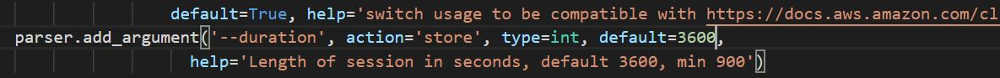
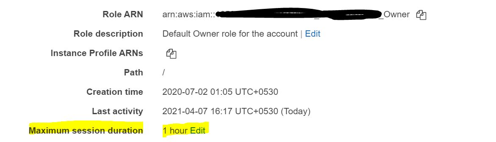

> Point of Contact: Pravin kumar S

> Last Reviewed Date: 11/02/2021

### Methods to overcome long running job failure using IAM roles.

### 1. Overview

#### 1.1 Purpose

   Products teams and cloud team use python authentication scripts to generate temporary secret credentials which has an expiration set to one hour, beyond which it cannot be used for authentication purpose. End users or the jobs need to re-authenticate beyond one hour to generate new credential token and setup new session to have their connections established to the cloud environment. However, long running jobs or individual users beyond one hour get their jobs failed as the token expire. 
   
#### 1.2 Scope

   The scope of this documentation is to provide the remediations identified to overcome long running job failure issue.

### 2. Configuration steps

#### Increasing the credential token expiration (recommended) 

   Individual users using AWSCLI or Jenkins jobs use authenticate_py3.py python authentication script to generate credential token which is valid for one hour and the environment will be set as per the profile created(Example: export AWS_PROFILE=saml). Authenticate_py3 script is called from Jenkins module/file or manually by end users to generate tokens. 

##### Steps to increase the session duration

**2.1.** Default session duration within the python script is set to one hour (3600 seconds), which can be updated within the script, or even when calling the authenticate_py3 script also duration parameter can be passed(in seconds) to set the token expiration. Therefore, tokens don't get expire and remain valid until the time set.

**2.2.** Further, within the AWS account we need to make sure the role which we assume for connecting and generating token has its max session duration set beyond one hour as per requirement. Roles like contributor, Owner, Read-only have their maximum session duration set as one hour. So we need to have special role created with maximum session duration set, assign policies specific to the use case. This role can be requested through secure and can be used for assuming role when generating tokens in AWSCLI/Jenkins etc. This overall method helps in avoiding the session token getting expired and lets the jobs run without failures.

AWS role can be created with maximum session duration of 2 hours as per Optum security policy. Architecture need to be planned such that workflows or pipeline should be running within the time limit of 2 hours. 

### 3. Conclusion

Overall after multiple discussion within internal and Amazon cloud support, to have a seamless and uninterrupted job running without any session disruption or session re-creation and also to maintain a secure credential management it would be preferable to have the session duration extension method while running the long running jobs.
