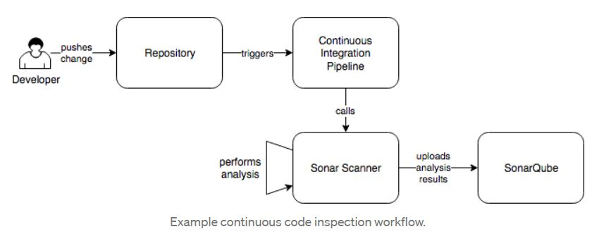

### Sonarqube integration with Jenkins

> Point of Contact: Atchaya Saminathan

> Last Reviewed Date: 08/26/2021

### 1. Overview
#### 1.1. Purpose 
    
   SonarQube is Code Quality Assurance tool that collects and analyzes source code and provides reports for the code quality of our project. When we integrate the Sonarqube with Jenkins, we can continously inspect the code quality and security.
 
#### 1.2. Scope
   
   The scope of this document is to provide the steps to integrate the Optum's Sonarqube (https://sonar.optum.com/) with Jenkins.
   
### 2. Pre-requisites

- Jenkins integration with GitHub (Web-hook) 

### 3. Architecture diagram



### 4. Configuration steps

#### 4.1. Configure the Sonar Server Credentials 

- Go to Jenkins > Manage Jenkins > Configure System
- Scroll down until you see an option called "SonarQube servers". Please enter the following details,

| Field | Value | 
|------|-------------|
| Name | sonar.optum |
| Server URL | https://sonar.optum.com |
| Server version | Select 5.6 or higher |
| Server Authentication Token | 092c919905283a6d35ff1abe2128fc52e48a6156 |


Note: You do not need to include a port number.

#### 4.2. Configure the Sonar scanner

- Go to Jenkins > Manage Jenkins > Global Tool Configuration
- Scroll down until you see an option called "SonarQube Scanner"
- Enter the name for the sonar scanner and select install automatically (Jenkins automatically install scanner) 
- Select the scanner version from the Install from Maven Central Version's drop down list.


#### 4.3. Configuring the Sonar properties

We should configure the sonar properties like project key, source path, etc.. to run the sonar-scanner against the code. We can pass the sonar properties either through the properties file at root level or through the inline command. 

##### 4.3.1. Through sonar project properties file 

Create the file 'sonar-project.properties' in the root directory of repository which needs to be scanned and add the below configurations to the file.

*sonar-project.properties*

```
#------------------------------------------------------------------
# must be unique in a given SonarQube instance
sonar.projectKey=com.optum.oaccoe:arena
# this is the name and version displayed in the SonarQube UI. Was mandatory prior to SonarQube 6.1.
sonar.projectName=Arena
sonar.projectVersion=3.0

# Path is relative to the sonar-project.properties file. Replace "\" by "/" on Windows.
# This property is optional if sonar.modules is set.
sonar.sources=.
sonar.java.binaries=.

# Encoding of the source code. Default is default system encoding
sonar.sourceEncoding=UTF-8
sonar.issuesReport.html.enable=true
```

*Jenkinsfile*

```
        stage('Sonar')
        {
            environment {
                scannerHome = tool 'sonar'                     // 'sonar' is the scanner name, replace with your scanner name.
            }
            steps
            {
                withSonarQubeEnv("sonar.optum") {              // 'sonar.optum' is the sonar server name, replace with your sonar server name if you are using other sonar server.
                    sh '${scannerHome}/bin/sonar-scanner' 
                } 
            }
        } 
```

##### 4.3.2. Through inline-command 

Add the below configuration to the Jenkinsfile to execute the sonar scanner.

*Jenkinsfile*

```
        stage('Sonar')
        {
            environment {
                PROJECT_NAME = "com.optum.oaccoe:arena"
                scannerHome = tool 'sonar'                     // 'sonar' is the scanner name, replace with your scanner name.
                PROJECT_VERSION = 3
            }
            steps
            {
                withSonarQubeEnv("sonar.optum") {              // 'sonar.optum' is the sonar server name, replace with your sonar server name if you are using other sonar server.
		   sh '${scannerHome}/bin/sonar-scanner -Dsonar.projectKey=$PROJECT_NAME -Dsonar.projectVersion=$PROJECT_VERSION'
                } 
            }
        } 
```

All project keys need to start with "com.optum.", or "com.uhc." followed by an "application identifier", followed by a ":" colon. The portion of the projectkey that follows the colon is variable and uniquely identifies the code being scanned.

##### 4.4. SonarQube dashboard

Once we committed the code/created a pull request, the Jenkins job will be triggered and sonar-scanner will be executed based on the properties file or inline command provided on previous step.  

We can see our latest sonar project details by searching the project name in the sonar dashboard https://sonar.optum.com/. Please find the screenshot for your reference.


 
