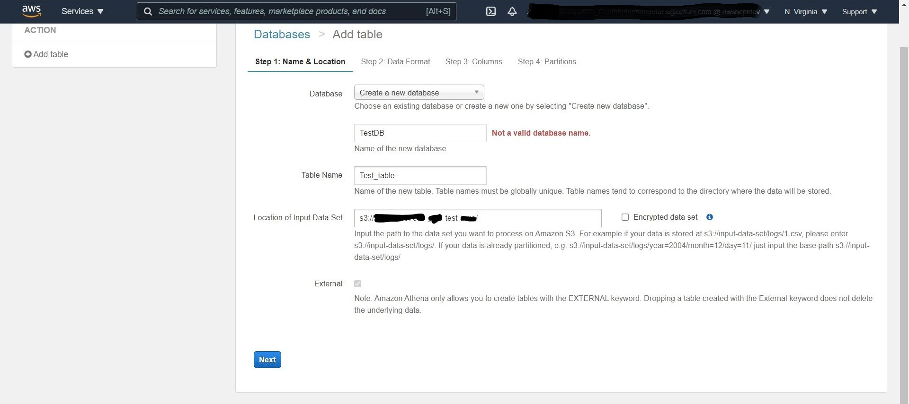

## Athena Cross Account Access

> Point of Contact: -, Surendar

> Last Reviewed Date: 08/12/2021

## What is athena
Athena is a server-less query tool to analyze the data from AWS S3. It automatically stores the query result and metadata information for each query in a location that you specify in Amazon S3.

## Architecture Diagram


## How to
### Accessing Amazon S3 buckets across accounts in Athena
The following will guide you through querying data across accounts in S3 buckets.

Step.1: Setup the permission. More references on setting up cross account permissions via IAM can be found below
https://arena.optum.com/docs/howto/Cross-account-access-to-objects-that-are-in-Amazon-S3-bucket/

S3 Bucket policy in Account A (where the S3 bucket is exist)
``` json
{
            "Effect": "Allow",
            "Principal": {
                "AWS": "arn:aws:iam::585807852923:role/AWS_585807852923_Contributor"
            },
            "Action": [
                "s3:ListBucket",
                "s3:GetObject"
            ],
            "Resource": [
                "arn:aws:s3:::165387667510-glue-test-arun/*",
                "arn:aws:s3:::165387667510-glue-test-arun"
            ],
            "Condition": {
                "ForAnyValue:StringEquals": {
                    "aws:CalledVia": "athena.amazonaws.com"
                }
            }
        }
```

IAM policy in Account B (where athena query execute)
``` json
{
            "Effect": "Allow",
            "Action": [
                "s3:GetObject",
                "s3:ListObject"
            ],
            "Resource": [
                "arn:aws:s3:::athena-test/*",
                "arn:aws:s3:::athena-test"
            ]
        }
```
Check out the following article for more details on how to provide cross-account access to a bucket encrypted
https://arena.optum.com/docs/Manage-cross-account-KMS-encrypted-s3-buckets/

Step.2: Follow the steps below to create the table from S3 bucket data

   Step.a: Select "Create Table"
  

   Step.b: Select "from S3 bucket data" option
  
 
   Step.c: Select an existing DB or create a new one and name the tables 

   Step.d: Provide the S3 location of another account 

  Note: The location should not be specified with the file name, but rather with the directory level
  

   Step.e: Specify the format of the input data
  

   Step.f: Specify the column name
  

   Step.g: You can create partitions if necessary, and then click Create table
  
The data can be queried from the newly created table in athena query editor

### Cross-Account Access to Data Catalogs in Athena
Here are the steps for accessing the cross-account data catalog in athena

Step.1: Setup the S3 bucket (data store) permissions, Refer the below article for more information
https://arena.optum.com/docs/howto/Cross-account-access-to-objects-that-are-in-Amazon-S3-bucket/

Please refer to the article below for information regarding Cross-Account Access to an Encrypted Bucket
https://arena.optum.com/docs/Manage-cross-account-KMS-encrypted-s3-buckets/

Step.2: Log in as an AWS Identity and Access Management (IAM) administrative user or as a user who has been granted ``` glue:PutResourcePolicy ``` permission.'

Navigate to Settings in the navigation pane.

Paste a resource policy into the text area of the Permissions section of the Data catalog settings page.

Then choose Save.

Sample policy
``` json
{
  "Version" : "2012-10-17",
  "Statement" : [ {
    "Effect" : "Allow",
    "Principal" : {
      "AWS" : "arn:aws:iam::585807852923:root"
    },
    "Action" : [
        "glue:GetDatabases",
        "glue:GetTables",
        "glue:GetTable"
        ],
    "Resource" : [ "arn:aws:glue:us-east-1:165387667510:table/*/*", "arn:aws:glue:us-east-1:165387667510:database/*", "arn:aws:glue:us-east-1:165387667510:catalog" ]
  } ]
}
```

Step.3: The data source must be created before performing a query

   Step.a: Go to "Connect data source" and click on it.
  

   Step.b: Choose "Glue data catalog in another account"
  
 
   Step.c: Enter the descriptive name and the description, as well as the catalog ID (account number)
  

  

   Step.d: Using the drop-down box, choose the data source created
  

The data source can now be viewed and queried


