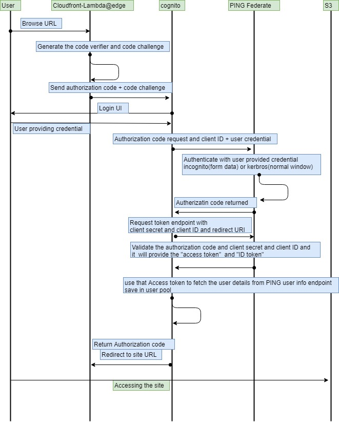
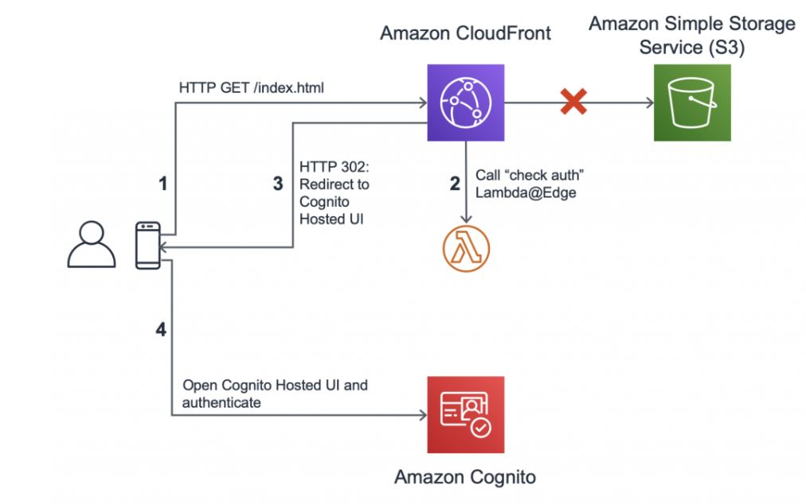
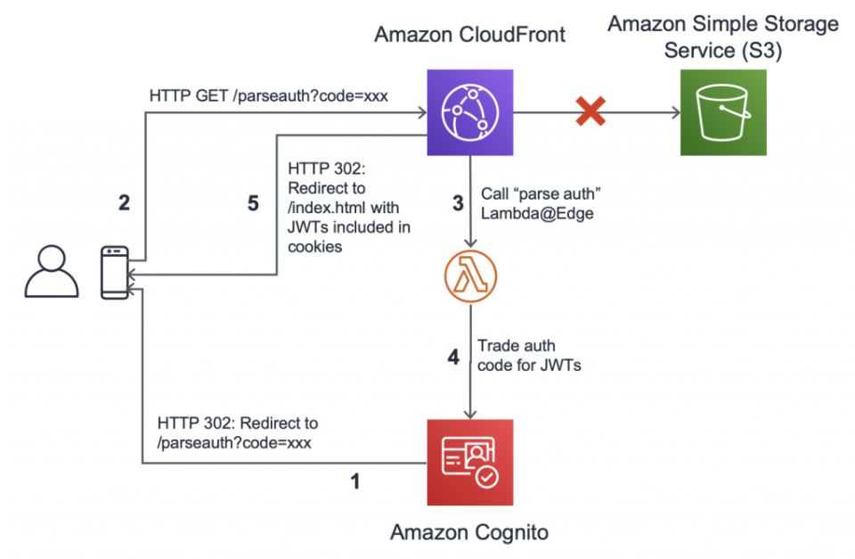
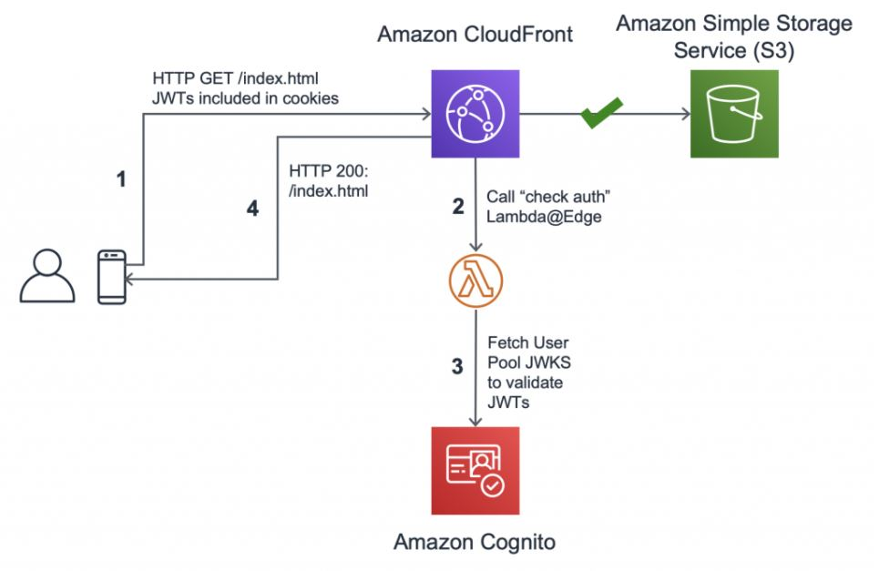

## OIDC Protocol workflow

### cloudfront authentication at edge

1.    A user navigates to the CloudFront URL.
2.   CloudFront distribution receives the viewer request and triggers the Lamba@Edge function. The function checks a cookie to validate the user’s authentication information. If the user is signing in for the first time and there is no valid cookie present, the Lambda@edge function redirects the user to authenticate.
3.    The user’s web browser is redirected to IDP custom UI page to sign in and authenticate.
4.    After authentication, IDP generates and cryptographically signs a JWT (JSON Web Token) then responds with a redirect containing the JWT embedded in the URL Path.
5.    The viewer’s web browser extracts JWT from the URL and makes a request to the content, adding an Authorization request header with JWT as the value.
6.    If the verification steps pass, Lambda@Edge strips out the Authorization header and allows the request to pass through to designated origin for CloudFront. User is redirected to the IDP page to re-authenticate in all other cases.
7.    CloudFront passes the request through to the origin. In this case, the origin is the Amazon S3 bucket.
8.    After retrieving the content from the S3 bucket, CloudFront sends the response back to the browser.
9.    The browser displays the response to the user.
For accessing the static website, two authentication methods are used. One is the PKCE authentication method and the other is the client secrect method.
To authenticate between the cognito and the user, the PKCE method is used, while between the cognito and PING, the client secret method is used.

### cloudfront authentication at edge Using AWS Cognito



``` Step.1 :```
-   The user attempts to access the static website through their browser, which tries to access the contents from the S3 bucket via CloudFront.
-   CloudFront distributions are configured with functions that inspect every incoming request. The function checks cookies to determine if they contain all the user's authentication information. If the information isn't there, it directs the user to sign in at the AWS cognito's hosted UI.
- CloudFront's response includes a state parameter that contains the originally-requested URL and a nonce. The nonce is also stored in a cookie. (Moreover, part of the OAuth flow involves another cryptographic construct - PCKE.




``` Step.2 :```
-   The user signs in to the pool's hosted UI and Cognito redirects them back to the cloudfront where the lambda function gets the authorization code and state parameter from the query string. It then compares the nonce in the state parameter to the cookie to ensure that they agree.
-   Lmabda function invokes the user pool’s token API to exchange the authorization code in the request for JWTs
-   JWTs are stored in cookies in the HTTP response. The Lambda function identifies the original URL by using the state parameter (included in the query string) and prepares a redirect to that URL.




``` Step.3 :```
-   In response to the redirect, the user's browser tries again. This time, it includes cookies with JWTs that were previously set.
-   The Lambda function checks the cookies, and now the cookies contain JWTs. To validate these JWTs, the function requires the JSON Web Key Set (JWKS) from the user pool.
-   By fetching the JWKS from the User Pool, Lambda function then validates the JWTs. If the JWTs are valid, the function replies to CloudFront with authorization



-   The user can now access the static website
