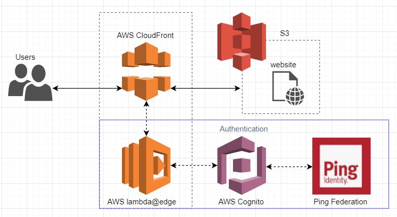

> Point of Contact: Surendar S

> Last Reviewed Date: 11/22/2021

AWS S3 is an Object Storage service that also allows hosting static websites publicly. You can use Amazon CloudFront to improve the performance of your Amazon S3 website. CloudFront caches content at edge locations for a period of time that you specify

This document will help you setup Single Signon authentication for the Static Websites / SPA hosted on the CloudFront Distribution.

:::note
You don't need to enable static website hosting on your bucket for this configuration. This configuration uses the REST API endpoint of the bucket instead of the website endpoint from the static website hosting feature.
:::

## Architecture

## Requirements
- Terraform ~> 0.14.10
- aws ~> 2.49
- python 3.6
- Node ~> 12

## Sections
We recommend that you start with the following sections:

[Cloudfront authentication workflow](./OIDC_workflow.md) - The process of authentication will be explained in detail

[Prerequisites](./Prerequisites.md) - Detailed prerequisites for the setup

[Module Usage](./Module_usage.md) - Terraform modules Link and how to use them