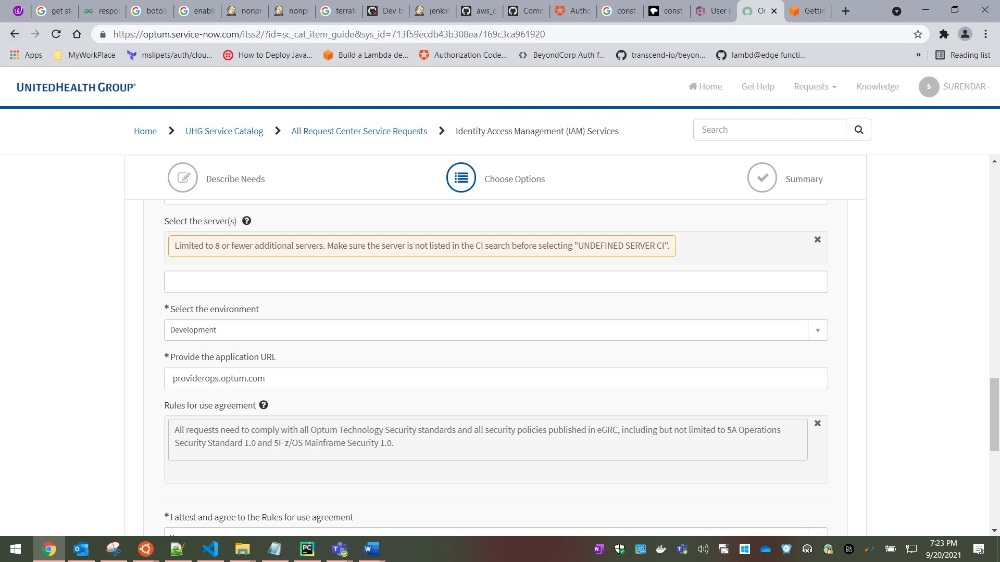

``` Step.1 :``` Open a support case to enable SSO at identity provider end.
-   Search for “Identity Access Management (IAM) Services”


-   Select “Identity Access Management (IAM) Services”


select “Single Sign ON (SSO/WAM)” & select “SSO to UHG Cloud/Azure hosted applications”, then click Next.  


Please fill out all the fields


Provide detailed description (you may provide like below)

we are setting up the SSO for static web site hosted on AWS and we are using AWS Cognito service to authenticate users through our PING identity provider. We need the following information to create a provider in AWS Cognito.

•	Client ID

•	Client secret 

•	Authorize scope

•	Issuer


Complete the WorkIntakeFormCorp WAM file and attach it to the support case after filling all the details therein



``` Step.2 :``` Please complete the intake form and attach it to your support case

``` Step.3 :``` Request the following information from the identity provider team once they have setup the configuration at their end
 - authorize_scopes
 - client_id
 - client_secret
 - oidc_issuer

:::note 
-   If you are authenticating via AWS cognito, proceed to step 4 or jump to step 5
:::
``` Step.4 :``` As shown below, identity provider team need to use redirect_uri

***https://< Replace with your domain name >.auth.us-east-1.amazoncognito.com/oauth2/idpresponse***

``` Step.5 :``` The WAM team will need to configure the SSO with redirect_uri at their end by providing the front end URL
Example: providerops.optum.com

Continue with Module usage