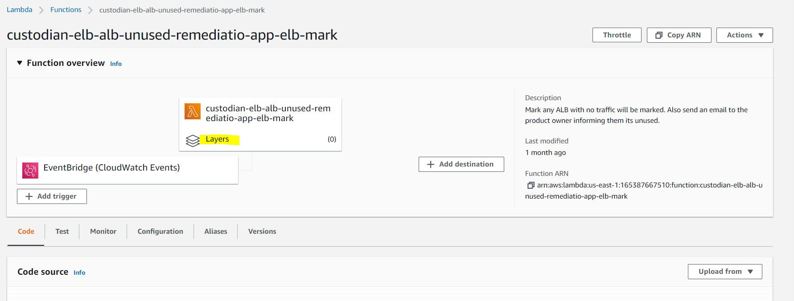

### AWS Lambda layer creation and sharing

> Point of Contact: Atchaya Saminathan

> Last Reviewed Date: 10/27/2021

## Contents

- [Overview](#Overview)
- [Pre-requisites](#Pre-requisites)
- [Configuration steps](#Configuration-steps)
- [Terraform module](#Terraform-module)

### Overview
#### Purpose

The Lambda layers provide a convenient and effective way to package code libraries for sharing with Lambda functions in our account. Using layers can help to reduce the size of uploaded archives and make it faster to deploy our code in Lambda. 

A Lambda layer is a .zip file archive that can contain libraries, a custom runtime, data, or configuration files. Layer promotes code sharing and separation of responsibilities so that we can concentrate on writing business logic.

At this time, we support the following layers,

- pymysql
- pyodbc
- pandas
- zeep
   
#### Scope

   1) Creating the lambda layers
   2) Sharing the lambda layers with other accounts

### Pre-requisites
   
   - IAM role with the lambda access
   
### Configuration steps

#### Creating a Lambda layer

##### Compilining a zip file

- Create the a directory with the name of your coding langugae like python, nodejs, ruby, java, etc...
- Install the required packages or copy the code whichever needed to the directory which created in above step. For example,

  `pip install pymysql -t python`

- After that, archive the direcotry using below command,

  `zip -r9 lambda-layer.zip python`
   
##### Creating the lambda layer

- Go to the 'Layers' section in AWS lambda console.
- Select create layer and provide the name and description.
- Select 'Upload a .zip file' if you have a zip file in local, else select 'Upload a file from Amazon S3' if you have a zip in S3. And then, click on 'Upload'.
- Select the compatible versions of layer in 'Compatible runtimes' field. We can provide upto 3 versions in this field.     
- And the, click on 'Create' button to create the layer.    

##### Adding the lambda lyer to lambda function

- Go to the 'Functions' section in AWS lambda console.
- Select you lambda function and click on 'Layers' in the funtion overview section.
 

- Then, click on the 'Add Layer' button to add the layers to the lambda function.

- Choose the 'custom layers', pick your layer from the drop down list and it's version.

- Click on 'Add' to attach the layer to lambda function. 

#### Sharing the Lambda layers

We can share the lambda layers with other AWS account and they can make use of the layers by adding them to their lambda function. Here, we should use the 'Specify an ARN' option while adding the layers to lambda function.

The command to share the lambda layer with other account:

`aws lambda add-layer-version-permission --layer-name MessageVendorLayer --version-number 1 --statement-id sharingWithOneAccount --principal 123456789012 --action lambda:GetLayerVersion`

**Note:** The lambda layer sharing can be achievalble through the CLI command only and we cannot do this from console.

### Terraform module

We have created the [terraform example module](https://github.optum.com/oaccoe/aws_lambda_example) for the lambda layer with the below features,

- Creating a layer from the locally available zip file
- Creating a layer from the zip file located in S3
- Creating a zip file and layer at runtime
- Sharing the layer with other account
