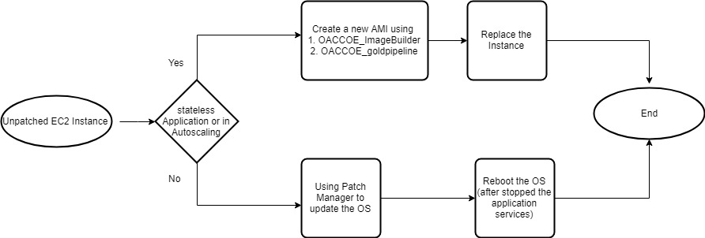

> Point of Contact: -, Surendar

> Last Reviewed Date: 12/10/2021

In general, identical servers or instances of stateless applications can be replaced with updated AMI but the DB-installed EC2 instances running as stand-alone instances can't be replaced with the updated AMI, since this is quite challenging. 

AWS Patch Manager, a capability of AWS System Manager, can be used in these cases to automate patching.



AWS Patch Manager automates the process of patching Windows and Linux managed instances using of Amazon EC2 tags or instances IDs to install patches to large groups of instances. AWS SSM Patch Manager, can scan for missing patches of your instances and install them. 

To use AWS SSM patch manager to patch your EC2 instances, you must comply with certain set-up requirements and pre-requisites

- The SSM Agent must be installed
- The SSM Agent for Windows also requires PowerShell 3.0 or later to run - some SSM documents
- Your EC2 instances must have outbound internet access
- You must access Systems Manager in a supported region
- Systems Manager requires IAM roles, below is the required policy should attach with IAM instance profile.

        arn:aws:iam::aws:policy/AmazonSSMManagedInstanceCore


You can patch fleets of Amazon EC2 instances. This includes supported versions of Windows, Ubuntu Server, Red Hat Enterprise Linux (RHEL), SUSE Linux Enterprise Server (SLES), and Amazon Linux. You can scan instances to see only a report of missing patches, or you can scan and automatically install all missing patches.

:::warning
-   AWS does not test patches for Windows or Linux before making them available in Patch Manager.
-   If any updates are installed by Patch Manager, the patched instance may need reboot.
-   Always test patches thoroughly before deploying to production environments.
:::

:::note SSM Agent is installed by default on:
-   Amazon Linux base AMIs dated 2017.09 and later
-   Windows Server 2016 instances
-   Instances created from Windows Server 2003-2012 R2 AMIs published in November 2016 or later. 
:::

:::tip
There is no additional charge for AWS Systems Manager. You only pay for your underlying AWS resources managed or created by AWS Systems Manager (e.g., Amazon EC2 instances or Amazon CloudWatch metrics). You only pay for what you use as you use it.
:::
## Consideration when patching EC2 standalone instance
We must know what patches we are going to apply prior to updating the OS patches for Linux or Windows servers.
When updating patches in Amazon EC2 where the database is running, there are few considerations.
-   Backup regularly on
    -   DB level
    -   Instance level
-   It is important that you thoroughly read the list of issues and bugs addressed in the patch
-   The update should first be applied to development/test instances. Once the instance runs without errors for a sustained period (i.e., for one or two weeks), you can apply the update to production.
-   All users who are likely to be impacted by the update, the database instance, or any system downtime should be notified by email
-   High availability  for the Database

## Steps
In general, operating system patches will be applied every month. As a best practice, patches will generally be applied to non-production systems first. Once non-production systems are patched, they will be monitored for a couple of days and then the same patches will be applied to production systems.

There are two ways to patch the instances
1.  Using [Console](./using-aws-ssm-patch-manager-console)
2.  Using [AWS COE patch manager module](./using-aws-ssm-patch-manager-module.md)

However below are the recommended steps to patching the instances with AWS SSM patch mangers

```Step.1: ``` Run the "Scan" operation on subjected non-production instances with the instance ID or tag to get details about patches

```Step.2: ``` Run "Install" operation on non production instances

```Step.3: ``` In production instances, it is recommended to patch after a week of patching in non-production

```Step.4: ``` Run the "Scan" Operation on production tagged instances or specific instance

```Step.5: ``` Verify the production patch details with non production patch details 

```Step.6: ``` Run "Install" operation on production only if there is no mismatch on the non production patch details

:::note
The backup should be done at the DB level, and it is best practice to keep the DB backup outside the DB instance. DB backup includes the system and user databases as well.
:::
