Patch Manager provides one predefined patch baseline for each supported operating system. These predefined patch baselines are used as the default patch baselines for each operating system type. Unless you create your own patch baseline and designate it as the ***default*** for the corresponding operating system type.

With custom patch baselines, you can decide which patches are approved or rejected for your environment.

:::note
-   AWS Patch manager calling the Run document "AWS-RunPatchBasline" to patch the instances. AWS-RunPatchBaseline document use default patch baseline to do patching the instances
-   Manual Backups are required before patching
:::

```Step.1: ``` Login into AWS console and navigate to AWS System manager and go to patch manager


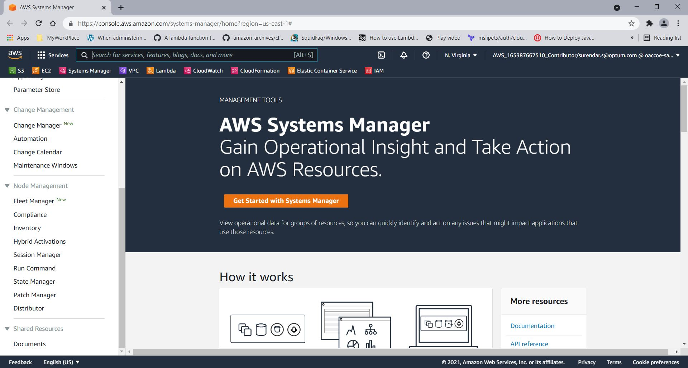
```Step.2: ``` go to ***Patch baseline***

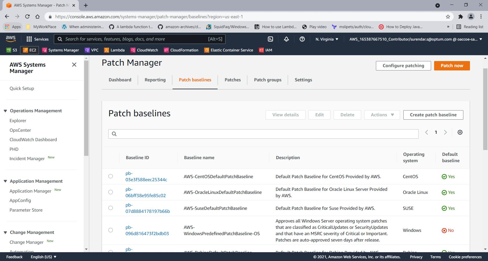
```Step.3: ``` Click on ***Create Patch baseline***. Here are listed AWS default patch baseline for each operating system.

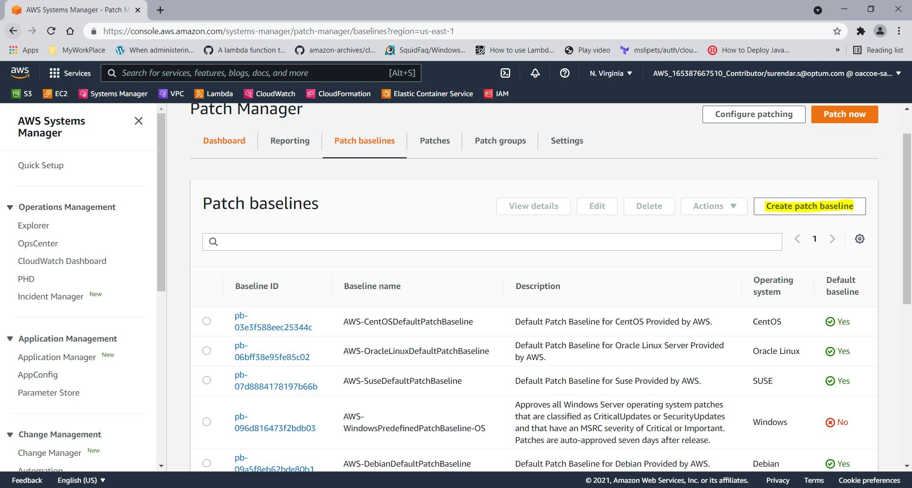
```Step.4: ``` Provide the below details to create the patch baseline
-   ***Name*** (You can use letters, numbers, periods, dashes, and underscores in the name.)
-   ***Description*** - optional
-   ***Operating system*** (Select the operating system you want to specify approval rules and patch exceptions for.)
-   check the box on ***Default patch baseline***  (Setting this patch baseline as the default means that it will be used when patching all the instances in your fleet)

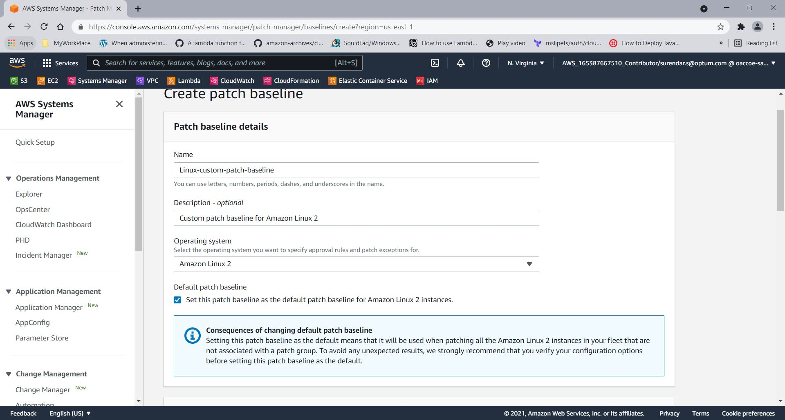

In ***Approval rules for operating systems*** Section

-   ***Product*** 
Product name (for operating systems): For example, RHEL 6.5, Amazon Linux 2014.09, Windows Server 2012, Windows Server 2012 R2, and so on.
Product name (for applications released by Microsoft on Windows Server only): For example, Word 2016, BizTalk Server, and so on.

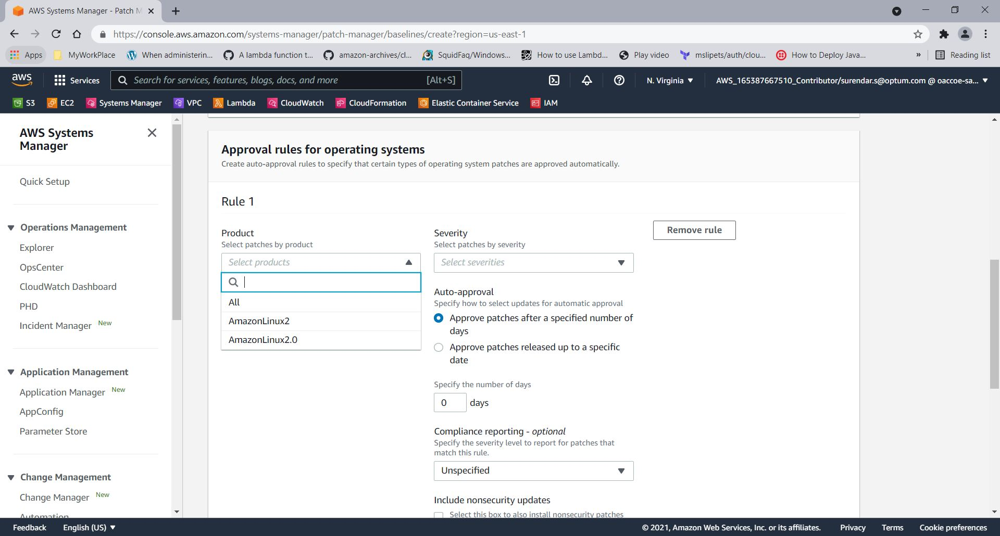

-   ***Classification*** For example, critical updates, security updates, and so on.
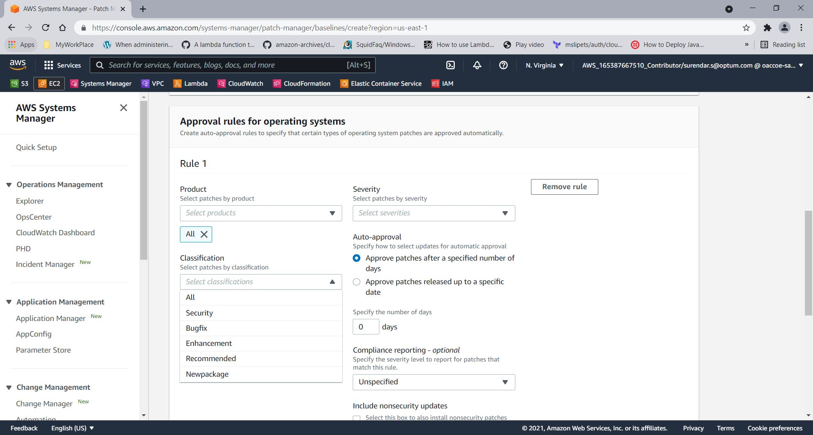

-   ***Severity*** For example, critical, important, and so on.
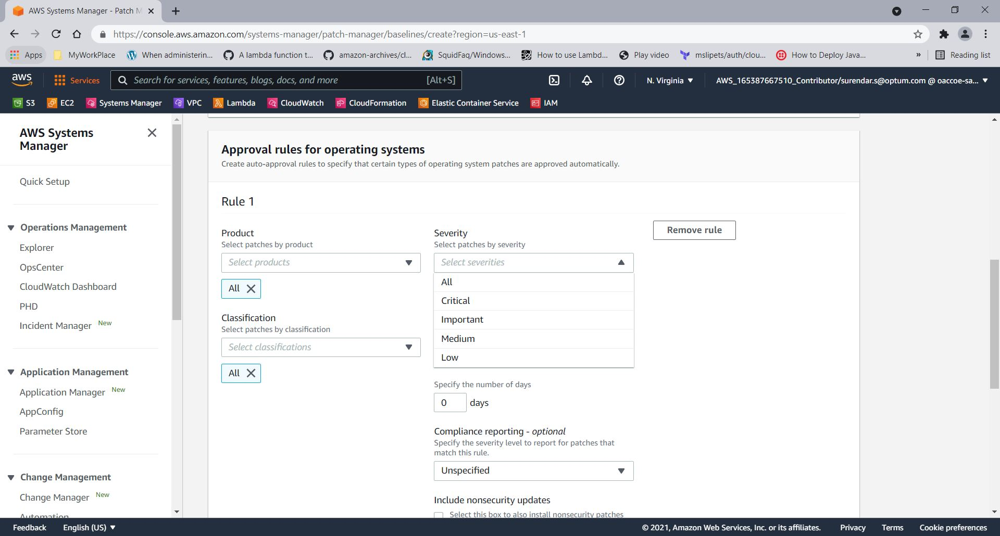

-   ***Auto-approval*** (Specify how to select updates for automatic approval). 

There are two option: 

1) Approve patches after a specified number of days

2) Approve patches released up to a specific date

:::tip        
***Approve patches after a specified number of days:***
An auto-approval delay is the number of days to wait after the patch was released, before the patch is automatically approved for patching. For example, if you create a rule using the CriticalUpdates classification and configure it for seven days auto-approval delay, then a new critical patch released on July 7 is automatically approved on July 14.
:::
:::tip
***Approve patches released up to a specific date:***
When you specify an auto-approval cutoff date, Patch Manager automatically applies all patches released on or before that date. For example, if you specify July 7, 2020, as the cutoff date, no patches released on or after July 8, 2020, are installed automatically.
:::

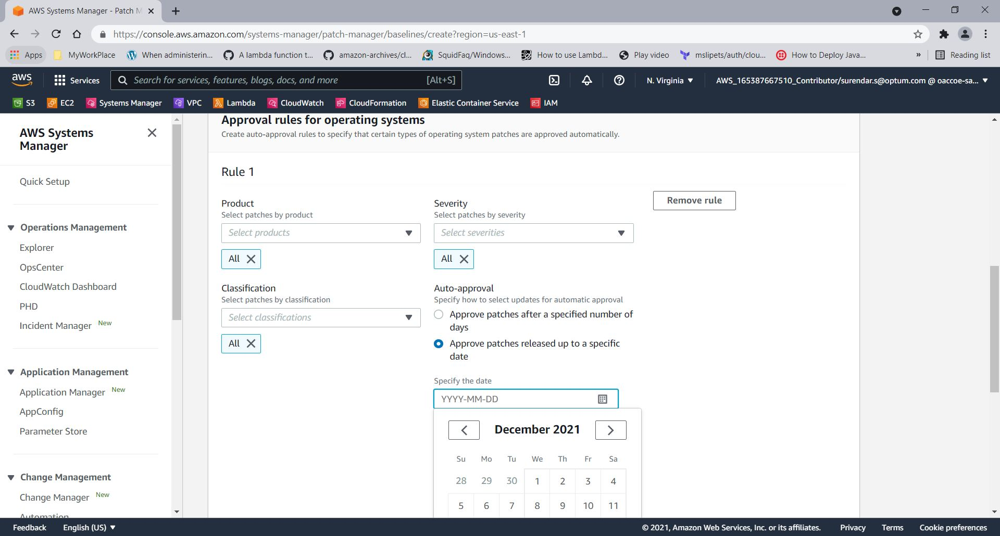


:::note
We are supposed to use "Approve patches released up to a specific date" options to patch. Since we can ensure that patches installed on non-production instances will be applied to production instances if they have been released on or before our specified date.
:::

```Step.9: ``` In ***Patch Exceptions*** you can add to lists of approved patches and rejected patches.


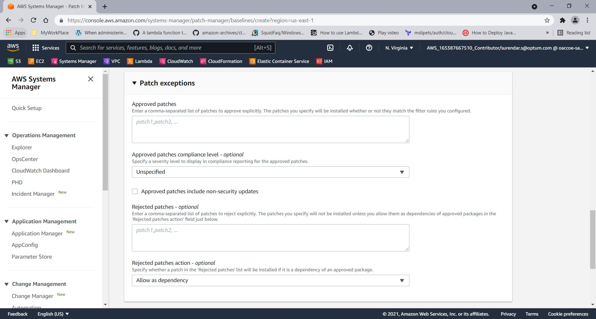

```Step.10: ``` Click on ***Create patch baseline*** and verify created the patch baselines is ***default***

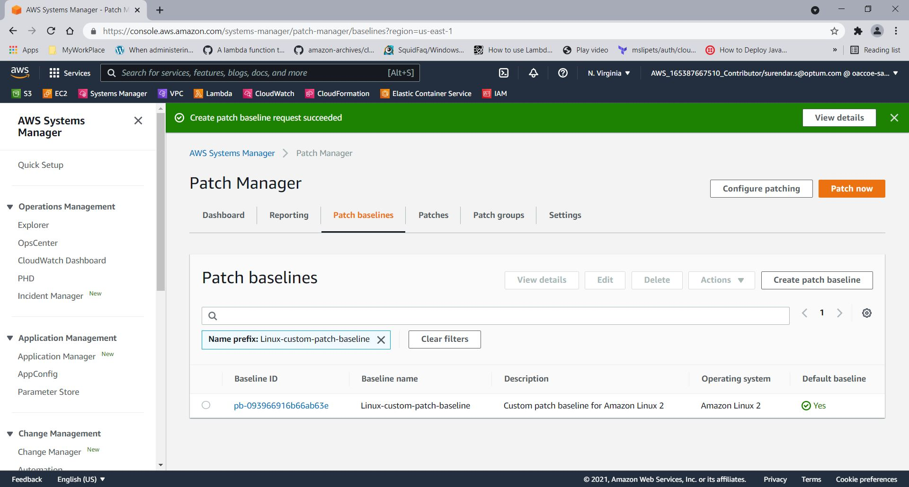


We can patch instances ***on demand*** or ***schedule*** them once the patch baseline is created.

***On-demand:***

The ***Patch now*** option lets you run an on-demand patching operation from the console

```Step.11: ``` Click on ***Patch now*** option on Patch manager windows


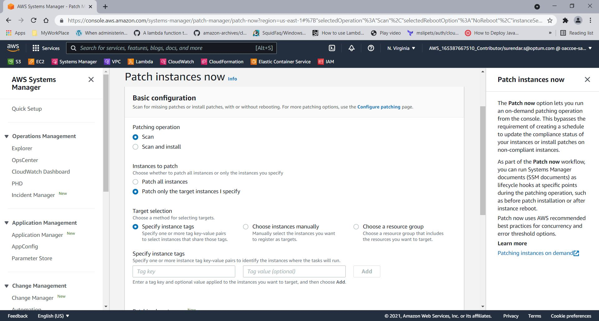


***Schedule:***

```Step.12: ``` ***configure patching*** to the target instances in schedules basis


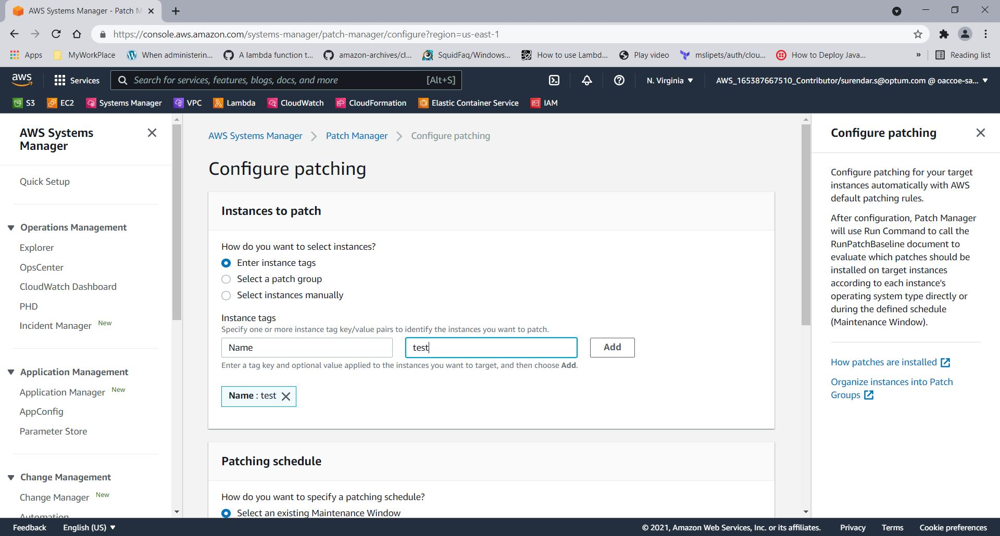

```Step.13: ``` Scheduling options are below 

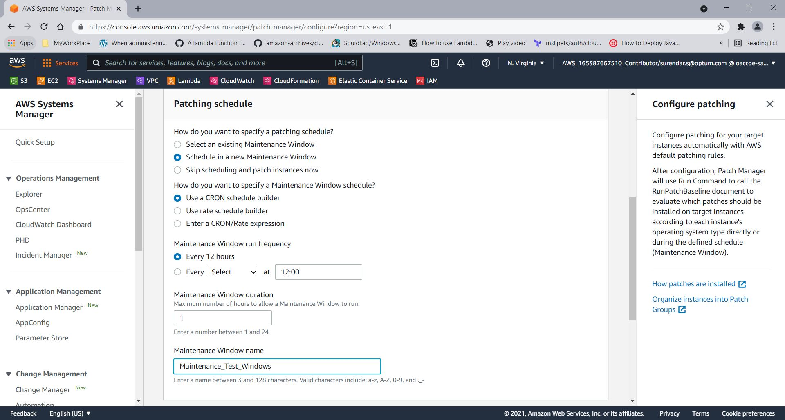


