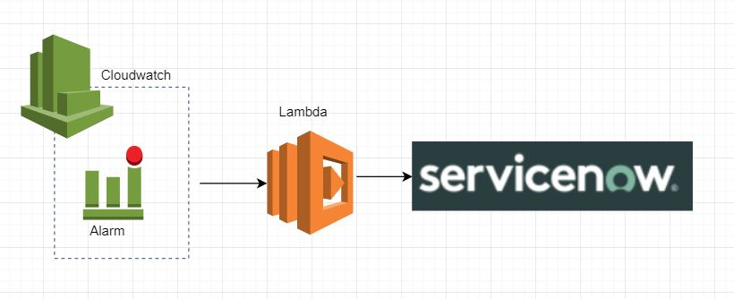

> Point of Contact: -, Surendar

> Last Reviewed Date: 11/25/2021

The document is intended to assist the product team in setting up the integration between service now and Amazon CloudWatch

CloudWatch allows you to monitor your AWS resources and to have full visibility into the operational health of your AWS infrastructure. It can be used to identify problems with performance. With ServiceNow, incidents can be quickly forwarded to the right teams so they can be resolved.

To setup the integration follow the below steps

[Prerequisites](./Prerequisites.md)

[Terraform Module Usage](./terraform-module-usage.md)
