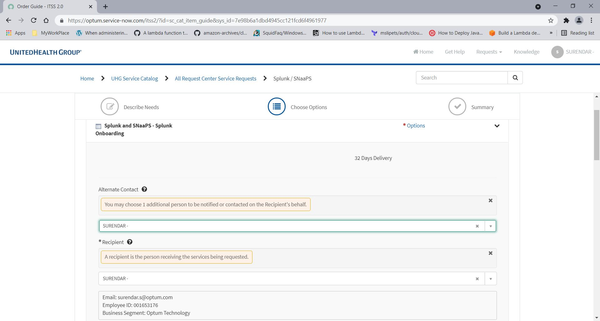

> Point of Contact: -, Surendar

> Last Reviewed Date: 12/15/2021

## Overview

The purpose of this documentation is to explain how to on board an application into Splunk

Splunk is Centralized Logging is a streaming log management platform, which aggregates logs from all cloud resources and applications into per Amazon Web Services account

AWS services which deliver logs directly to S3 instead of CloudWatch should be configured to the lp-cl-{accountID}-{region} bucket.
Launchpad supports centralizing logs from any CloudWatch log group. Subscriptions are controlled by a lp-cl-subscribe tag. If true, the log group's logs will be centralized by Launchpad. If false, the log group will be ignored.

Any log group matching any of the following naming conventions will be automatically subscribed to central logging regardless of tag value:

/lp/cl/*

/aws/rds/*

/aws/lambda/*

/aws/states/*

/aws/ec2/*

/aws/apigateway/*

/aws/guardduty/*

API-Gateway-Execution-Logs

For more information please refer the [link](https://github.optum.com/healthcarecloud/launchpad_documentation/tree/master/logging#aws-1)


| Logs                                      | Publisher / Responsible Party   | In-Transit Storage | Agg                            | Type(s)                                                                                        |
| ----------------------------------------- | ------------------------------- | ------------------ | ------------------------------ | -----------------------------------------------------------------------------------------------|
| [CloudTrail][2] with [S3 Data Events][3]  | Launchpad                       | [S3](#S3)          | `cloudtrail`                   | `cloudtrail,digest`                                                                            |
| [VPC Flow Logs][1]                        | Launchpad                       | CloudWatch         | `aws-cloudwatch`               | `lp-cl-vpcflowlogs`                                                                            |
| [Lambda][14]                              | Launchpad                       | CloudWatch         | `aws-cloudwatch`               | `aws-lambda-{resource_name}`                                                                   |
| [Redshift DB][7]                          | Launchpad                       | [S3](#S3)          | `awsredshift`                  | `aws-redshift-{cluster_identifier}`                                                            |
| \*\*[RDS][4]                              | Launchpad                       | CloudWatch         | `aws-cloudwatch`               | `aws-rds-instance-{resource_name}-{log_type}`                                                  |
| [CloudFront Access Logs][6]               | Launchpad                       | [S3](#S3)          | `w3c`                          | `cloudfront`                                                                                   |
| [ELB Access Logs][5]                      | Launchpad                       | [S3](#S3)          | `awselasticloadbalancing`      | `aws-elasticloadbalancing-{load_balancer_name}`                                                |
| [DynamoDB Logs][78]                       | Launchpad                       | [S3](#S3)          | `cloudtrail`                   | `cloudtrail,digest`                                                                            |
| [Step Function Logs][80]                  | Launchpad                       | CloudWatch         | `aws-cloudwatch`               | `aws-states-{state_machine_name}-Logs`                                                         |
| System Logs - Windows                     | Launchpad                       | CloudWatch         | `aws-cloudwatch`               | `aws-ec2-lp-cl-logs`                                                                 |
| System Logs - Linux                       | Launchpad                       | CloudWatch         | `aws-cloudwatch`               | \*\*\*`aws-ec2-lp-cl-logs`         | 
| Application Logs                          | Application                     | CloudWatch         | [Computed](#custom-log-groups) | [Computed](#custom-log-groups)                                                                 |
| Application Logs                          | Application                     | S3                 | [User Defined](#application-logs-for-s3) | [User Defined](#application-logs-for-s3)                                                                 |
| Application (e.g. NESS)                   | Application _(Not Implemented)_ | \*CloudWatch       | \*`ness`                       | Set by Application                                                                             |
| [WAF (Web Application Firewall) logs][81] | Launchpad                       | [S3](#S3)          | `w3c`                          | `waf`                                                                                          |
| [API Gateway Logging][82]                 | Launchpad                       | CloudWatch         | `aws-cloudwatch`               |`aws-apigateway-lp-cl-{api_id}-{stage_name}`, `api-gateway-execution-logs_{api_id}-{stage_name}`|
| [GuardDuty Findings][83]                  | Launchpad                       | CloudWatch         | `aws-cloudwatch`               | `aws-guardduty-lp-cl-guardduty-findings`                                                       |


> NOTE: Cloudtrail S3 Data Events logs fulfill S3 access log requirements

> NOTE: DynamoDB logging via CloudTrail does not log every event. See [docs](https://docs.aws.amazon.com/amazondynamodb/latest/developerguide/logging-using-cloudtrail.html) for the list of supported actions. If you require more detailed logging you will want to evaluate a proxy solution (Example: [Envoy](https://www.envoyproxy.io/docs/envoy/latest/intro/arch_overview/other_protocols/dynamo))

> NOTE: Step Function logging requires the state machine to have proper permissions to log to a CloudWatch log group. See [this document](https://docs.aws.amazon.com/step-functions/latest/dg/cw-logs.html#CloudWatch-iam-policy) for an example IAM policy to configure permissions.


## Architecture Diagrams


## Prerequisites

-   Create AWS Account if doesnt exists
The steps described in this article will help you set up an new AWS account. https://arena.optum.com/docs/howto/provisioning-a-new-aws-account
-   ASK ID
-   Application name
-   AWS account number

## On boarding the application

```Step- 1 :```   Go to https://optum.service-now.com/itss2/

```Step- 2 :```   click on ***Request Something***


```Step- 3 :```   Search ***Splunk / SNaaPS***


```Step- 4 :```   Click on "Splunk onboarding (option)"


```Step- 5 :```   Provide the alternate contact



```Step- 6 :```   Select the type of service & Select the Splunk intake process based on the log type as per the below screen shot

```Step- 7 :```   select "Yes" to Are you a member of the Health Care Cloud Launchpad team.


```Step- 8 :```   Select "Yes" for I have read and agree to the Splunk terms and conditions & provide the application details as per the below screen shot


```Step- 9 :```   Select Technical contact

```Step- 10 :```   Provide a list of all the monitoring tools this application is using today

```Step- 11 :```   Describe the issue(s) or pain point that is expected to be resolved by adding Splunk to the application

```Step- 12 :```   Provide the monthly average number of war rooms for this application

```Step- 13 :```   Does the service fall under the Offshoring Governance Office (OGO) level 7 restriction category?

```Step- 14 :```   Select "No" Do the logs contain enclave or payment card industry (PCI) data?

```Step- 15 :```   Select the environment type(s)


:::note
Based on the environment splunk access URL will be change
:::
 
```Step- 16 :```   Provide the daily log file ingestion rate in megabytes (MB)

```Step- 17 :```   select "No" for Is this request to add or update Raw Error Rate (RER)?

```Step- 18 :```   Provide a brief summary for your request

As per the ticket, splunk team will set up splunk at backend. Once set up, they will communicate with requestor with splunk access URL and secure group information.

:::tip
For reference refer this sample tickt - RITM1880239
:::

## Requesting the secure group
To access the Splunk URL, you must be a member of a secure group created by the Splunk team
go to https://secure.uhc.com/

click on "Add Group Membership"


Search the secure group and request access 


## Accessing Splunk

Splunk access is granted by Secure and owned by the application team for each application or service.

[Splunk Non-Prod url](https://est-sh.stage.aws-splunk-optum.com/)

[Splunk Prod url](https://est-sh.prod.cloud-splunk-optum.com/)


You can search for Index and Secure group names here
[Splunk Platform Service Mapping](https://uhgazure.sharepoint.com/sites/OptumSplunk/SitePages/Splunk-Platform-Service-Mapping.aspx)

:::tip
The secure group can be easily found with ASKID
:::

Having trouble on finding the group or index? Please contact below E-Mail ID.

O2M_Splunk_ADM_Tech_Team_DL_DL@ds.uhc.com

Issue on sending data contact below E-Mail ID.

Public_Cloud_TechOps_DL@ds.uhc.com

For More information about - [Centralized Logging](https://cloud.optum.com/docs/launchpad/centralized-logging/)


