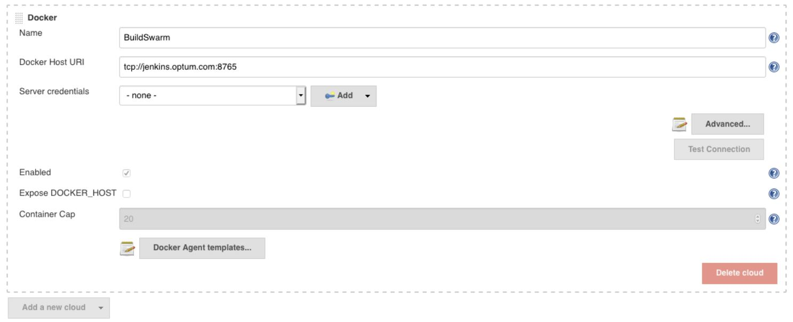
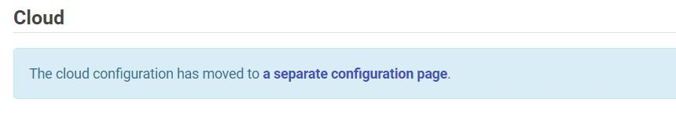
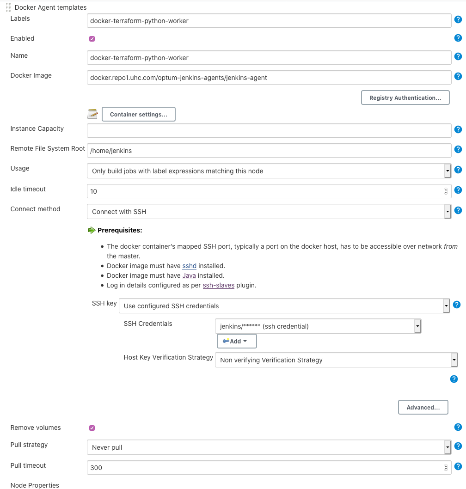
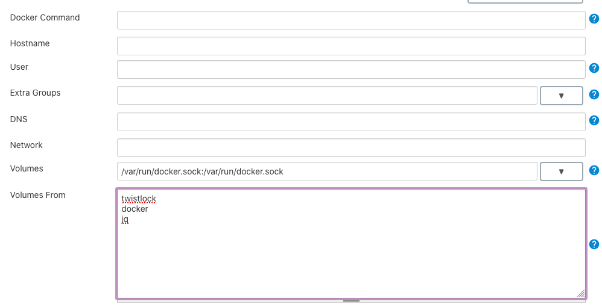

### Twistlock integration with Jenkins

> Point of Contact: Atchaya Saminathan

> Last Reviewed Date: 11/1/2021

### Overview
#### Purpose 

  The Prisma Compute, formerly known as Twistlock is a Cloud Native Cybersecurity Platform provides full lifecycle security for containerized environments.

  The Twistlock Platform provides vulnerability management and compliance across the application lifecycle by scanning images and serverless functions to prevent security and compliance issues from progressing through the development pipeline, and continuously monitoring all registries and environments.
 
#### Scope
   
  The scope of this document is to provide the steps to integrate the Optum's Twistlock (https://containersecurity.optum.com) with Jenkins.
   
### Pre-requisites

- Jenkins integration with GitHub (Web-hook) 

### Configuration steps

#### Adding a Mixin to a Build Agent

- Go to Jenkins > Manage Jenkins > Configure System
- Navigate to the build agent configuration. On older jenkins, this will be directly in 'Configuration', whereas newer jenkins have it on a seperate page

*Older Jenkins configuration*



*New Jenkins configuration*



- Click on the 'Docker Agent templates...' button
- Create a new mixin or choose the existing mixin that you want to add twistcli too. For the example, we will choose a custom created docker agent of 'docker-terraform-python-worker'. Ensure the 'Docker Image' and 'Connect Method' matches the blow screenshot.



- Expand out the 'Container settings...' button of the agent configuration
- Make sure that 'Volumes' filed contains '/var/run/docker.sock:/var/run/docker.sock'
- Make sure that 'Volumes From' field contains below,

  ``` 
  twistlock
  docker 
  jq 
  ```


- Press the 'Save' button at the bottom of the screen.

#### Configure the Jenkinsfile

- Update the pipeline build agent to use the same build agent label as we configured above. 
- Enable the Twistlock Container Security Scanning easily with GPL (Global Pipeline Library) by adding the below stage along with the other stages.

*Jenkinsfile*

```
stage('Twistlock Docker Security Scan') {
  agent { label 'docker-terraform-python-worker' }
  steps {
    glDockerImagePull credentialsId: "${env.DOCKER_CREDS}",
	    image: "${env.IMAGE_WITH_TAG}",
	    containerRegistry: "docker.repo1.uhc.com"

    glTwistlockScan dockerRepository: "${env.DOCKER_REPOSITORY}",
      twistlockCredentials: "${env.TWISTLOCK_CREDS}"
  }
}

```
*Example with arguments*

```
pipeline {
  agent { label 'docker-terraform-python-worker' }
  environment {
    CREDS = 'a9a0897e-235f-4690-817a-3c5a5309b0ce'
  }
  stages {
    stage('Twistlock') {
      steps {
        glDockerImagePull credentialsId: "$env.CREDS",
          image: "docker.repo1.uhc.com/alpine",
          containerRegistry: "docker.repo1.uhc.com"
        glTwistlockScan dockerRepository: "docker.repo1.uhc.com/alpine:latest",
          twistlockCredentials: "$env.CREDS"
      }
    }
  }
}

```

This method requires the image to already be present on the node running the twistlock scan. The examples include a glDockerImagePull method to pull down the image prior to scanning.

The method reports the results to the Twistlock Scanning Results Dashboard (currently https://containersecurity.optum.com), and also displays the results in the console output in the build.

We can customize the threshold levels for pass/fail, as well as a number of other parameters. All of the parameters are strings except for the failBuild parameter, which is true or false (and true by default). The following is a full list of parameters, their required status, default options, and meanings:

| Parameter	| Required/Optional	| Default Value	| Meaning |
|---------------|-----------------------|---------------|---------|
| dockerRepository |	Required |	NONE	| Full path to the docker image (including tag), either Artifactory or DTC|
|twistlockCredentials	| Required	| NONE	| Jenkins Credential ID for Twistlock. Format as MSID/Password |
| failBuild |	Optional | true	| Indicates whether to fail the build when thresholds are not met (true/false) |
| userDomain	| Optional	 | ms	| The domain of the Twistlock user account |
| vulnerabilityThreshold |	Optional |	critical	| The vulnerability threshold to fail at (critical/important/high/moderate/low) (--vulnerability-threshold) |
| complianceThreshold	| Optional |	critical	| The compliance threshold to fail at (critical/important/high/moderate/low) (--compliance-threshold) |
| twistlockDashboardUrl	| Optional |	https://containersecurity.optum.com	 | The location of the Twistlock scan results dashboard (--address) |
| outputFile |	Optional	| null	| The file to write results too, if defined (ex: results.json) (--output-file) |
| useTls |	Optional |	false	| Indicates whether the Docker daemon requires a TLS connection |
| pathToCaCert	| Optional	 | ~/.docker/ca.pem |	The path to the Docker client ca certificate |
| pathToClientCert |	Optional |	~/.docker/cert.pem |	The path to the Docker client certificate |
| pathToClientKey	 | Optional |	~/.docker/key.pem |	The path to the Docker client private key |
