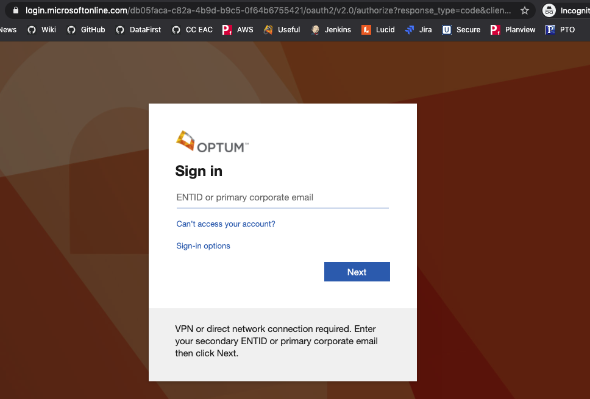
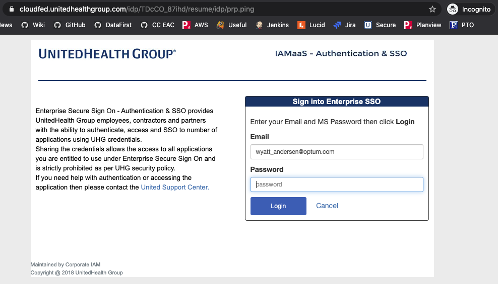

> Point of Contact: Kushal Naidu

> Last Reviewed Date: 11/02/2021

### Cloud Board

### 1. Overview

[Cloud Board](https://cloud.optum.com/cloudboard/dashboard) is a tool provided by the Health Care Cloud (HCC) team the offers two main functions:

* Tracking eGRC violations, aka "Launch Pad" violations
* Aggregating information about your cloud account from HCC, Service Now, and ASK

The Cloud Board is a self-service one-stop-shop designed to manage, govern, and optimize spend in the Public Cloud environment.

Cloud Board is designed to handle various user personal (Engineer, Product, Managers, Leaders) who have unique needs based on their role.

Behind the scenes, the Cloud Board connects to Launchpad, ServiceNow, Secure, AIDE, BigQuery via REST services and APIs to retrieve various account and application-related information.

More info [here](https://commercialcloud.optum.com/docs/products/cloudboard.html).

### 2. Pre-requisites

Being in at least one "AWS_'account id'_'name'" Security group that is linked between Optum SSO and AWS IAM (if you can use the group to log into AWS via [Optum's SSO portal](https://signon.uhg.com/ping/AWSRouterSSO.asp) you should be able to see info about that account in Cloud Board).

Every account you have MSID access to should should show up for you in Cloud Board.

### 3. Accessing CloudBoard

**3.1.** Go to https://commercialcloud.optum.com/

**3.2.** Click "Log In" in the upper right

**3.3.** Enter your Optum email address 

**3.4.** Enter you Optum email address and MSID password

**3.5.** Click on "[Cloud Board](https://cloud.optum.com/app2/cloudBoard)" on the left hand navigation

### 4. Benefits

- Compliance Dashboard - Notify, report, track history and provide directions to remediate security compliance issues.
- Multi Cloud Visbility - Provides multi cloud security and compliance visibility for all the users and across multiple applications in a single interface.
- Budget Management - Spend plans, cost visibility, and budget enforcement mean you'll have no surprises.

